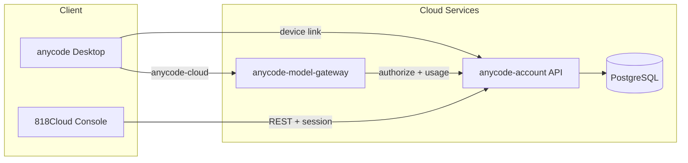
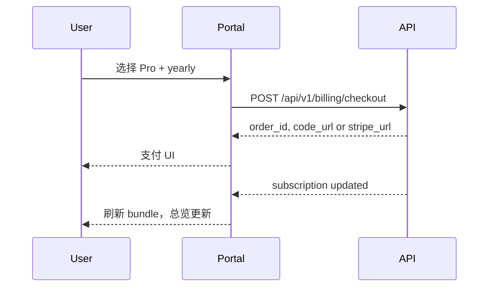

# 818Cloud Console — 信息架构

> 导航模型、数据依赖、路由权限与 API 契约对齐。  
> **套餐模型**：Free / Pro / Team，月付 / 年付；无滚动窗口配额。

---

## 1. 系统上下文

---

## 2. 导航模型

### 2.1 一级导航（Workbench `/account`）

| ID | section | 标签 (zh) | 标签 (en) |
|----|---------|-----------|-----------|
| `overview` | `overview` | 总览 | Overview |
| `usage` | `usage` | 用量 | Usage |
| `plan` | `plan` | 套餐 | Plans |
| `billing` | `billing` | 账单 | Billing |
| `api` | `api` | API Keys | API Keys |
| `enterprise` | `enterprise` | 团队 | Team |

**默认落地**：`section=overview`（非套餐页）。

侧栏底部 **额度摘要卡片**：当前套餐 + 本账期 token 进度条。

### 2.2 顶栏

- 云端账号邮箱
- 在云端门户管理 / 退出
- 语言切换（全局 Layout）

---

## 3. 套餐门控

| 功能 | Free | Pro | Team |
|------|------|-----|------|
| 本地 Workbench | ✓ | ✓ | ✓ |
| 托管 token 额度 | 低配额 | 5M/月 | 20M/月 |
| API Keys | 1 | 5 | 20 |
| 团队管理 | — | — | ✓ (10 seats) |

门控 UI：非 Team 进入团队页显示升级引导，不 500。

---

## 4. 核心流程

### 4.1 升级套餐（月付/年付）

### 4.2 账期额度用尽

1. 用量达 token_limit 或 Gateway 返回 429
2. 用量页顶部警告 +「升级套餐」CTA
3. 显示账期结束日 / 剩余天数（非滚动窗口倒计时）

---

## 5. 数据模型

### Account Bundle — `GET /api/v1/account/bundle`

| 字段 | 消费页面 |
|------|----------|
| `subscription.plan` | 总览、套餐 |
| `subscription.billing_cycle` | 总览、套餐、账单 |
| `subscription.period_*` | 总览、账单 |
| `subscription.days_remaining` | 总览、用量 |
| `entitlements.token_limit` | 总览、用量 |
| `entitlements.api_key_*` | 总览、API |
| `entitlements.seat_*` | 总览、团队 |
| `invoices[]` | 账单 |

**不消费**：`calls_*`、`quota_window_*`、`quota_resets_at`（已废弃于 UI）。

### 用量 — 本地 Workbench API

- `usageMetrics(days)` → KPI + 按模型表
- `usageExportUrl` → CSV

---

## 6. i18n

前缀：`service.*`（Workbench）/ `console.*`（独立门户迁移时）

禁止 UI 展示未解析 key。

---

## 7. 错误状态

| HTTP | UI |
|------|-----|
| 401 | 跳转登录 / 云端门户 |
| 403 | 无权访问 |
| 429 | 账期额度用尽警告 |
| 5xx | 重试 + 错误说明 |
