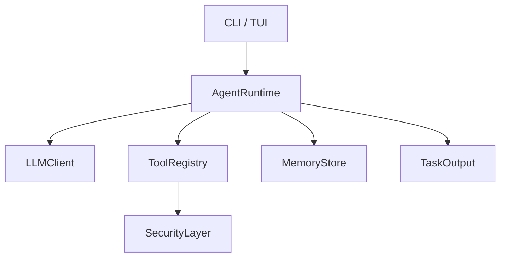

# Architecture

anyCode is a **Rust-first** terminal agent: CLI/TUI share one **runtime assembly** path (`initialize_runtime` in `crates/cli/src/bootstrap/runtime.rs` → `AgentRuntime` with `RuntimeCoreDeps` / `RuntimeMemoryOptions` / `RuntimeToolPolicy`).

**Repository**: Chinese maintainer-oriented notes live in `docs/architecture.md` (not built by this site). **ADRs** (orchestration, memory boundaries) are under `docs/adr/` on GitHub only. See also [Contributing extensions](./contributing-extensions).

## Layers (high level)

- **CLI (`crates/cli`)**: argument parsing, config, bootstrap, TUI modules, REPL, WeChat bridge wiring.
- **Agent (`crates/agent`)**: `AgentRuntime`, tool loop, persistence, summaries.
- **Core / security / tools / llm / memory**: shared types, policies, tool implementations, LLM adapters, memory backends.

CLI `run`, REPL, and TUI share the same **AgentRuntime** construction (config, tools, `SecurityLayer`).

## AgentRuntime

- **Input**: `Task` (agent type, prompt, `TaskContext`: cwd, optional `system_prompt_append`, etc.).
- **Output**: streaming events to **TaskOutput** (e.g. `~/.anycode/tasks/<id>/output.log`) plus a final **summary** when applicable.

## LLM abstraction

`LLMClient::chat(messages, tools, config)` is implemented per vendor (z.ai OpenAI-compatible, Anthropic Messages, optional OpenAI). `ModelConfig` carries `model`, `base_url`, `temperature`, `max_tokens`, etc.

## Security

`SecurityPolicy` lives in **anycode-core**; **anycode-security** registers compiled allow/deny rules and drives approval callbacks (TUI y/n, WeChat broker, or disabled for `--ignore-approval` / bridge modes).

## Design patterns and extension points

| Pattern | Where | Role |
|--------|--------|------|
| **Facade** | `initialize_runtime`, `AgentRuntime` | Hides LLM + registry + `SecurityLayer` + memory wiring from CLI/REPL/TUI. |
| **Strategy** | `LLMClient` implementations, `ApprovalCallback` | Swap vendor or approval UI without changing the tool loop. |
| **Registry** | `build_registry_with_services`, `catalog` | Single place to add default tools; see the checklist at the top of `registry.rs`. |
| **Dependency injection** | `ToolServices` / `ToolRegistryDeps` | Tools receive `Arc` services instead of globals. |
| **Template-style loop** | `execute_task` / `execute_turn_from_messages` | Fixed phases: LLM → tool calls → results; shared **tool surface** logic lives in `runtime/tool_surface.rs` to avoid drift. |

### Orchestration authority

Multi-turn **LLM + tool** orchestration lives only in **`AgentRuntime::execute_task`** and **`execute_turn_from_messages`**. The **`Agent`** trait supplies type, tool subset, and system-prompt hooks; **`Agent::execute`** is **not** the main CLI/TUI path (see `anycode-core` trait docs and the repo file **`docs/adr/000-runtime-orchestration.md`**).

### Cooperative cancel (turns and nested agents)

Main-session and line/stream REPL turns pass an optional `Arc<AtomicBool>` into **`execute_turn_from_messages`**. Nested **`execute_task`** runs use **`TaskContext.nested_cancel`** (from **`NestedTaskInvoke.cancel`**). Background nested agents register a job flag; **`TaskStop`** sets that flag and aborts the spawned task. Outcomes use **`CoreError::CooperativeCancel`** (same display as legacy `LLM error: cancelled`); use **`CoreError::is_cooperative_cancel`** or **`anycode_core::anyhow_error_is_cooperative_cancel`** when handling **`anyhow::Error`**. See **`docs/adr/002-cooperative-cancel-and-nested-agents.md`**.

### Session notifications (HTTP / shell)

Optional **`config.json`** **`notifications`** block posts versioned JSON (**`schema_version`**, **`event_id`**) on tool results and agent turns—**separate** from **`memory.pipeline`** hooks. User-facing field table and OpenClaw-style notes: [Session notifications](./notifications).

### Extension allowlist (where to change things)

- **Default tools**: `crates/tools/src/registry.rs` + `catalog.rs` + `SECURITY_SENSITIVE_TOOL_IDS` (must stay aligned with `bootstrap` policy registration).
- **LLM providers**: `crates/llm` (`transport_for_provider_id`, provider modules).
- **Approval / deny**: `crates/security`, `SecurityLayer` callbacks from `bootstrap`.

### Anti–over-abstraction (team norms)

- Add a new **public trait** only after **two** real implementations (or two callers) need it; otherwise use `enum`, free functions, or `pub(crate)` modules.
- Do **not** add a generic plugin host, dynamic `.so` loading, or a second execution engine alongside `AgentRuntime`.
- **Skill** marketplace-style distribution can evolve incrementally. **Nested agents** are **not** stubs: the **`Agent`** / legacy **`Task`** tools invoke **`SubAgentExecutor` → `AgentRuntime`** (see [Roadmap](./roadmap) P5 for fields and isolation).

## Design notes

- Prefer **new implementations** (new tool, new provider) over widening core traits until a second real backend justifies abstraction.
- Tool registry is the single place to extend default tools; sensitive tool ids are centralized for policy registration.

### `runtime/` layout

Besides the tool loop, `crates/agent/src/runtime/` includes **`tool_surface.rs`**: resolving which tool names an agent exposes to the LLM (including `mcp__*` merge for `general-purpose`), deny-regex filtering, Claude permission gating, and stable ordering—so `execute_task` and TUI turns stay in sync.

---

For diagrams, module file lists, and roadmap alignment (MCP, LSP, etc.), see [架构（中文）](/zh/guide/architecture).
