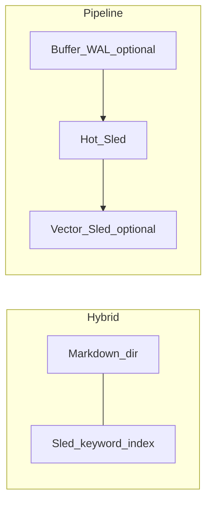

# Memory notes

## `anycode setup` (TTY)

After model credentials, setup offers:

- **Skip** — keep JSON as-is  
- **`memory.backend=noop`** — disable persistent recall  
- **Markdown preset** (`hybrid`) — Markdown under `memory.path` plus a sibling **keyword index** (`*.sled`). Default **highlight** in the menu.  
- **Remote embeddings** (`pipeline`) — OpenAI-compatible `embedding_base_url` + model; embeddings reuse **`llm.api_key`** unless you edit JSON later.  
- **Local ONNX** (`pipeline` + `embedding_provider=local`) — only if the binary is built with **`--features embedding-local`**.

**Not surfaced in setup:** `file`‑only backends and **`pipeline` without embeddings** — edit `~/.anycode/config.json` instead.

## Lightweight alternative: pure `file`

若只要目录 Markdown、**不想要** Hybrid 自带的旁路 sled，仍可手动设 **`memory.backend: file`**（JSON 默认值即 `file`）。Setup 主推 Hybrid 作为主目录 + 检索体验。

## Hybrid vs pipeline

| | **Hybrid (`hybrid`)** | **Pipeline (`pipeline`)** |
|---|------------------------|----------------------------|
| Primary store | Markdown 根目录 | 归根通道 hot Sled + 可选只读并入 legacy `*.md` |
| Extras | 旁路 **关键词** sled | 可选 **缓冲 + WAL**，晋升钩子， autosave ingest |
| Vectors | 无（Setup 中选向量会切到 pipeline） | 可选 `*.pipeline.vec.sled` + HTTP / 本地嵌入 |

## Current backends (reference)

`memory.backend`: `noop` | `file` | `hybrid` | **`pipeline`** (aliases: `layered`, `guigen`).

With **`pipeline`** and `merge_legacy_file_recall` (default true), existing `*.md` under the memory root merge **read-only** into recall.

**Autosave**: `memory.auto_save` + runtime hooks. With **`pipeline`**, autosave **ingests** into the ephemeral buffer before promotion.

Optional `memory.pipeline` fields include: `buffer_ttl_secs`, `max_buffer_fragments`, `promote_touch_threshold`, `reinforce_on_recall_match`, `merge_legacy_file_recall`, `buffer_wal_enabled`, `buffer_wal_fsync_every_n`, `hook_after_tool_result`, `hook_after_agent_turn`, `hook_max_bytes`, `hook_tool_deny_prefixes`, `embedding_enabled`, `embedding_model`, `embedding_base_url`, `embedding_provider`, `embedding_local_cache_dir`.

## WAL & vectors

- **WAL**: When `buffer_wal_enabled`, buffer state appends to `*.pipeline.buffer.wal` beside the hot DB; replayed on startup; `fsync` per `buffer_wal_fsync_every_n` and on bridge / task checkpoints.
- **Vectors**: Enabled when pipeline embedding fields / `embedding_provider` request it; stored in `*.pipeline.vec.sled`. See project docs for `--features embedding-local`.

**CLI import**: `anycode memory import [--dry-run] [--limit N]` imports legacy Markdown into pipeline hot (`memory.backend: pipeline`).

## OpenClaw parity (research backlog)

Same checklist as before: write triggers, retrieval strategy, compaction interaction — track outside the CLI binary.

## Related

- [Architecture](./architecture)  
- [Config & security](./config-security)
