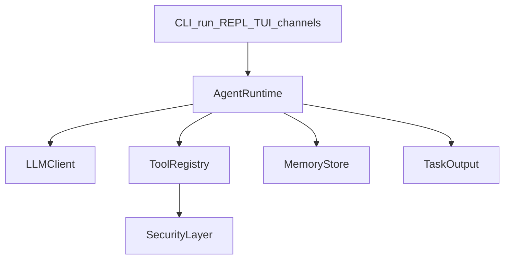
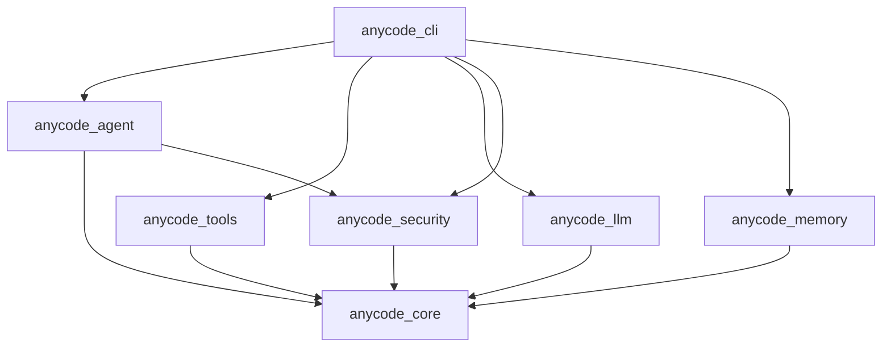

# anyCode 架构（渐进式披露）

本文从架构师视角说明 anyCode 的分层与数据流，以及在 Rust 中的演进方式。

**仓库内**：维护者向中文备忘见 `docs/architecture.md`（不经过本站构建）；**ADR** 在 `docs/adr/`。运行时组装入口为 `crates/cli/src/bootstrap/runtime.rs`（`initialize_runtime` → `AgentRuntime`）。扩展清单见 [扩展与贡献清单](./contributing-extensions)。

## 设计取舍

- **交互**：执行期可观察（progress/log stream），结束后总结回执（summary），工具编排优先。
- **系统能力**：模型配置与管理、长时间运行（run/REPL/TUI）、安全层与可扩展边界。
- **实现**：Rust 统一底座，类型安全与稳定运行。

## 分层（稳定接口 + 可替换实现）

CLI 的 `run`、`REPL` 与 `TUI` **共用**同一 `AgentRuntime` 构建路径（配置、工具、`SecurityLayer` 一致）。

### CLI 二进制分层（`crates/cli`）

避免单文件 `main.rs` 膨胀：入口只做解析与分发，配置与运行时装配拆分模块。

- `cli_args.rs`：Clap 顶层参数与子命令
- `app_config.rs`：`~/.anycode/config.json`、`Config` 聚合体、`model`/`config` 子命令与 serde 测试
- `bootstrap.rs`：`initialize_runtime`（LLM + `Arc<ToolServices>` + `build_registry_with_services` 构建全量工具表 + `SecurityLayer` + `AgentRuntime`）
- `tasks.rs`：`run`、可选 REPL、`list-*`、`test-security`
- `tui/`：`mod.rs` + `run/mod.rs`（导入）、`run/draw.rs`（单帧绘制）、`run/event.rs`（crossterm）、`run/exec_completion.rs`（turn 完成回填）、`run/loop_inner.rs`（终端初始化、`select!` 与状态装配）、`input` / `transcript` / `chrome` / `approval` / `styles` / `util`；其余大块 UI 仍可在 `*_body.inc` 中 `include!` 保持单文件可浏览
- `md_tui.rs`：Markdown 渲染与终端排版

### Agent crate 分层（`crates/agent`）

- `agents.rs`：内置 `Agent` 实现（general-purpose / explore / plan）
- `runtime/`：`AgentRuntime` 与工具循环、落盘、回执（多文件模块）
- `lib.rs`：对外 `pub use`；单元测试体量大时置于 `agent_test_mod.inc` 由 `include!` 拉入，避免淹没入口文件

### 安全策略单一来源（`crates/core` + `crates/security`）

- `SecurityPolicy` 定义于 **`anycode-core`**（`security_policy.rs`），工具元数据与安全层共用，避免两套同名结构漂移
- **`anycode-security`** 在注册策略时 **预编译 deny/allow 正则**，避免每次工具调用重复 `Regex::new`

### AgentRuntime（编排核心）

- 输入：`Task(agent_type, prompt, context)`
- 输出：**执行期事件流**（写入 TaskOutput） + **结束期 summary**（最终回执）

### TaskOutput（执行期可观察）

- 设计目标：把执行过程（task/llm/tool 的关键事件、工具输出摘要）持久化到：
  - `~/.anycode/tasks/<task_id>/output.log`
- 好处：
  - CLI/TUI 可以增量 tail（恢复能力强）
  - 为 summary 阶段提供“可压缩的运行轨迹”

### LLM 层（z.ai + Anthropic）

- 统一入口：`LLMClient::chat(messages, tools, config)`，由 `build_llm_client` 按 `provider` 选择实现
- **z.ai**：OpenAI 兼容 `chat/completions`，支持 `tools` / `tool_calls` 与多轮工具历史（见 `anycode_tool_calls` metadata）
- **Anthropic**：Messages API，`tool_use` / `tool_result` 映射为 core 消息模型
- `ModelConfig` 允许覆盖：`model`、`base_url`、`temperature` / `max_tokens`
- 重试策略：对 **429/5xx** 做指数退避（减少瞬时限流导致的失败）

### 设计模式与扩展点（维护约定）

| 模式 | 落点 | 作用 |
|------|------|------|
| **Facade（外观）** | `initialize_runtime`、`AgentRuntime` | 对外隐藏 LLM + 工具表 + `SecurityLayer` + 记忆装配。 |
| **Strategy（策略）** | `LLMClient` 实现、`ApprovalCallback` | 换厂商或审批 UI 而不改工具循环骨架。 |
| **Registry（注册表）** | `build_registry*`、`catalog` | 扩展默认工具的唯一入口（见 `registry.rs` checklist）。 |
| **Dependency injection** | `ToolServices` / `ToolRegistryDeps` | 工具通过 `Arc` 服务取依赖，避免全局单例。 |
| **过程式模板** | `execute_task` / `execute_turn_from_messages` | 固定阶段：LLM → tool_calls → 回注；**工具名/schema 解析**内聚在 `runtime/tool_surface.rs`，避免两条路径漂移。 |

**扩展白名单**：默认工具 = `crates/tools` 的 `registry.rs` + `catalog.rs` + `SECURITY_SENSITIVE_TOOL_IDS`；LLM = `crates/llm` 的 transport/provider；审批 = `SecurityLayer` 与 `bootstrap` 回调。

**反过度抽象（团队共识）**：至少**两个**真实差异实现（或两处调用方）再抽 **public trait**；否则用 `enum`、函数或 `pub(crate)` 模块。不引入通用 **PluginHost**、动态 `.so` 加载、或与 `AgentRuntime` 并行的**第二套执行引擎**。**Skill** 插件市场等形态仍按需演进；**嵌套 Agent** 已由 **`Agent` / `Task` 工具** 走 **`SubAgentExecutor` → `AgentRuntime`**（字段与隔离级别见 [路线图](roadmap.md) P5），不是占位 stub。

### 协作式取消（主会话与嵌套）

主会话与行式/流式 REPL 将可选的 `Arc<AtomicBool>` 传入 **`execute_turn_from_messages`**。嵌套 **`execute_task`** 使用 **`TaskContext.nested_cancel`**（来自 **`NestedTaskInvoke.cancel`**）。后台嵌套任务注册任务级标志；**`TaskStop`** 置位并 `abort` 后台任务。取消结果用 **`CoreError::CooperativeCancel`**（展示文案与历史 **`LLM error: cancelled`** 一致）；处理 **`anyhow::Error`** 时用 **`CoreError::is_cooperative_cancel`** 或 **`anycode_core::anyhow_error_is_cooperative_cancel`**。详见仓库 **`docs/adr/002-cooperative-cancel-and-nested-agents.md`**。

### 会话通知（HTTP / shell）

可选的 **`config.json`** **`notifications`** 在工具结果与 assistant 回合结束时投递带版本号的 JSON（**`schema_version`**、**`event_id`**），与 **`memory.pipeline`** 钩子独立。字段说明与 OpenClaw 式对接见 [会话通知](./notifications)。

**编排权威说明**（决策记录见仓库 **`docs/adr/000-runtime-orchestration.md`**）：

- **Strategy（补充）**：`LLMClient`、`Tool`、`Agent` 等 trait 由不同实现替换行为；新增厂商或工具时优先加实现而非改接口。
- **反模式（当前不采纳）**：全局 DI 容器、全链路事件总线、单实现 stub 再抽 `trait XxxBackend`；插件 ABI 无产品需求前不设计。

### 推迟项（与 roadmap 一致）

- **MCP**：stdio 多会话、`mcp__*` 动态工具与 `security.mcp_tool_deny_patterns` 已见 [路线图](roadmap.md) 工具矩阵 P3；**SSE/HTTP 传输、完整 OAuth 产品流**仍推迟。
- **其它 Stub（主要为 LSP 等）**：部分仍为占位或实验 feature；接入第二套真实形态后再收紧 trait。
- **多通道**：`anycode-channels` 预留；接入 CLI 时用适配器映射到现有 `Task` / 消息模型，避免 core 反向依赖通道 crate。

详见 [`models.md`](models.md) 中「运行时配置 vs Cargo `openai` feature」的区分。

## 编排权威与模块边界

### 谁负责「跑起来」

- **主路径**：`anycode_agent::AgentRuntime::execute_task` 与 `execute_turn_from_messages`（TUI 连续会话）实现多轮 `LLMClient::chat` → 工具执行 → 回注消息；**以二者为编排权威**。
- **`Agent` trait**：用于 **agent 类型**、**工具子集**、**system 提示合成**（`tools()`、`description()`、`system_prompt_replaces_default_sections`）；`Agent::execute` **不是**当前 CLI/TUI 主路径（见 `anycode-core` 中 trait 文档说明）。

### Crate 依赖方向（约定）

- **`anycode-core`**：领域类型与 `LLMClient` / `Tool` / `MemoryStore` 等 trait；**不**依赖 `cli`、`tools`、`agent`。
- **敏感工具策略**：`catalog::SECURITY_SENSITIVE_TOOL_IDS` 为 **单一事实来源**，CLI `bootstrap` 遍历注册 `SecurityLayer`；勿在 `bootstrap` 再维护平行列表。

### `agent` crate 内 `runtime/` 拆分（可读性）

- [`limits.rs`](../../../crates/agent/src/runtime/limits.rs)：工具循环常量（与 `execute_task` / `execute_turn_from_messages` 共用）。
- [`tool_surface.rs`](../../../crates/agent/src/runtime/tool_surface.rs)：解析 agent 对 LLM 暴露的工具名（含 `general-purpose` 合并 `mcp__*`）、deny 正则与 Claude gating、稳定排序与 `ToolSchema` 构建。
- [`artifacts.rs`](../../../crates/agent/src/runtime/artifacts.rs)：截断与 `Artifact` 提取（纯函数 + 单测）。
- [`task_summary.rs`](../../../crates/agent/src/runtime/task_summary.rs)：末条 assistant 检测与 LLM summary 回执构造。

## 两阶段输出：执行期日志 + 结束期 summary

这是 anyCode「边做边看」体验的核心。

1) **执行期**：只输出进度与事实（工具事件/输出），避免“长对话刷屏”  
2) **结束期**：用模型对运行轨迹进行压缩，输出 5-10 行总结（summary）

这套模式还能自然扩展到：
- 远端/后台任务（只要能落盘/传输事件）
- 多通道（Telegram/Slack 等）只接收 summary 或关键事件片段

