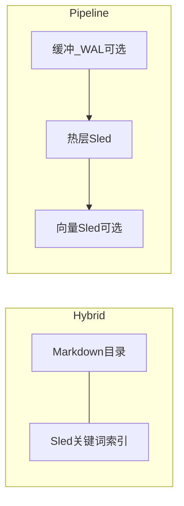

# 记忆系统说明

## `anycode setup`（交互 TTY）

模型鉴权之后会进入记忆步骤：

- **跳过** — 不写 `memory`
- **`noop`** — `memory.backend=noop`，关闭持久召回
- **Markdown 预设（hybrid）** — `memory.path` 下 Markdown + 同名 **关键词 sled**；菜单默认高亮项
- **远程嵌入（pipeline）** — OpenAI 兼容 `embedding_base_url` + 模型；HTTP 向量默认复用 **`llm.api_key`**，需独立密钥时请事后改 JSON
- **本地 ONNX（pipeline + local）** — 仅在用 **`embedding-local`** 构建的二进制上出现

向导中**不出现**：纯 **`file`**、**不开向量** 的 pipeline；高级用法直接编辑 `~/.anycode/config.json`。

## 更轻：只要目录 Markdown（`file`）

若你希望**仅** Markdown 文件、不要 Hybrid 的旁路 sled，可手写 **`memory.backend: file`**（JSON schema 默认值也是 `file`）。向导将 Hybrid 作为主推荐路径是为了「目录 + 检索」一体体验。

## Hybrid 与 Pipeline

| | **Hybrid** | **Pipeline** |
|---|------------|----------------|
| 主存储 | Markdown 目录 | 归根热层 + 可选只读并入 legacy `*.md` |
| 附加 | 旁路 **关键词 sled** | 可选 **缓冲+WAL**、晋升、autosave ingest |
| 向量 | 无（向导里选向量会切 pipeline） | 可选 `*.pipeline.vec.sled` + HTTP/本地嵌入 |

## 后端一览

`memory.backend`：`noop` | `file` | `hybrid` | **`pipeline`**（别名 `layered`、`guigen`）。

Pipeline 且 `merge_legacy_file_recall` 为默认 true 时，根目录既有 `*.md` **只读**并入召回。

**自动保存**：`memory.auto_save` + runtime 钩子；Pipeline 下 autosave 走 **buffer ingest**，多次触碰后才入热层。

可选 `memory.pipeline` 字段同英文文档所列（TTL、钩子、embedding 相关等）。

### WAL 与向量

- **WAL**：`buffer_wal_enabled` 时缓冲写入 `*.pipeline.buffer.wal`，启动重放并按策略 `fsync`。
- **向量**：由 pipeline embedding 字段控制，落地 `*.pipeline.vec.sled`；本地依赖 **`embedding-local`** 构建。

**导入**：`anycode memory import [--dry-run] [--limit N]` 需 `memory.backend: pipeline`。

## 与 OpenClaw 对标（研究 backlog）

写入时机、检索策略、与 `/compact` 的关系等仍建议在 issue 跟踪。

## 相关

- [架构](./architecture)  
- [配置与安全](./config-security)
