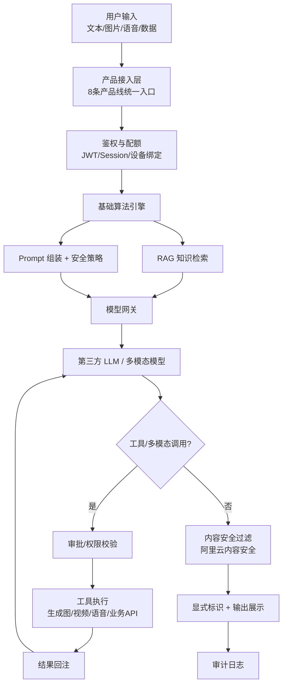

# 互联网信息服务算法安全自评估报告

**（生成合成类-服务提供者）**

> **说明**：本报告针对本公司统一基础算法「灵栖智能多模态内容生成基础算法」，覆盖当前全部 AI 产品系统，一次备案、多产品关联。

---

## 封面信息

| 字段 | 内容 |
|------|------|
| **主体名称** | 杭州灵栖智能科技有限公司 |
| **统一社会信用代码** | 91330108MAE2L0B33H |
| **算法名称** | 灵栖智能多模态内容生成基础算法 |
| **算法类型** | ☑ 生成合成类 |
| **算法应用领域** | 智能对话、文本/代码生成、图像生成、视频生成、语音合成与识别、数字人交互、企业知识检索增强 |
| **算法使用场景** | 统一支撑 anyCode、有书、灵栖智库、灵栖数字人、灵栖短视频、灵知、算力共享平台、翼动数字化工作台等全部 AI 产品 |
| **算法上线情况** | ☐ 已上线，时间：____ ☑ **未上线，正在内测阶段**（部分产品内测/私有化交付中） ☐ 未上线，正在开发阶段 |
| **自评估时间** | 2026 年 7 月 |
| **报告撰写时间** | 2026 年 7 月 9 日 |

### 算法基本情况（150 字内）

灵栖智能多模态内容生成基础算法，基于大语言模型与 RAG、智能体编排技术，统一支撑本公司全部 AI 产品的对话问答、文本/代码/图像/视频/语音生成及企业知识检索服务。通过模型网关接入第三方合规模型，配套安全审批、内容审核、日志审计与生成标识机制，应用于研发辅助、内容创作、企业知识管理与经营分析场景。

### 算法备案类型

☑ 算法未备案  
☐ 算法已备案，备案编号：  
☐ 备案已注销，备案编号：  
☐ 其他

### 附件引用

- **拟公示内容**：「灵栖智能多模态内容生成基础算法」拟公示内容（见附件 `algorithm-filing-base-public-disclosure.md`）
- **主体责任**：「杭州灵栖智能科技有限公司」落实算法安全主体责任基本情况（已有，2026-06-18 版本）

---

## 评估算法描述

### 1. 算法简介

本算法是本公司 AI 产品线的**统一生成合成基础能力**，技术栈包括：
- **对话/文本生成**：OpenAI 兼容 API 调用（Agnes、智谱、DeepSeek、通义千问等）
- **RAG 检索增强**：向量嵌入（BGE-zh/FastEmbed）+ 语义检索（MaxKB、灵知、anyCode KnowledgeSearch）
- **智能体编排**：anyCode AgentRuntime、翼动工作台 LangGraph 多智能体
- **多模态合成**：文生图（Agnes-image）、文生视频（agnes-video-v2.0）、TTS/STT（Edge TTS、FunASR、Apple Speech）
- **数字人驱动**：Live2D 形象 + 语音对话（灵栖数字人）

### 2. 应用范围

| 类型 | 产品 | 服务方式 |
|------|------|----------|
| 公有云 | anyCode Cloud（anycode.work）、有书（story.818cloud.com） | 注册用户使用 |
| 私有化交付 | 灵栖智库、灵栖数字人、灵栖短视频、灵知、翼动工作台 | Docker 部署至客户内网 |
| 内部运营 | 算力共享平台 | 企业内部使用 |

### 3. 服务群体

- 软件开发人员与技术团队（anyCode）
- 网络文学创作者（有书）
- 制造业企业（灵栖产品线：智库/数字人/短视频）
- 需企业知识管理的公司（灵知、灵栖智库）
- 集团/事业部经营管理人员（翼动工作台）
- GPU 算力供需企业（算力共享平台）

### 4. 用户数量

| 产品 | 当前状态 | 用户规模（2026年7月） |
|------|----------|----------------------|
| anyCode Cloud | 内测 | 注册约 30 人，日活约 8 人 |
| 有书 | 内测/试运营 | 注册约 20 人 |
| 灵栖智库/数字人/短视频 | 私有化 POC | 约 5 家企业客户试点 |
| 灵知 | 研发/内测 | 内部测试 |
| 翼动工作台 | 单客户交付 | 1 家企业部署 |
| 算力共享平台 | 内部运营 | 内部使用 |
| **合计** | — | 注册用户约 **50** 人，企业客户约 **6** 家 |

### 5. 社会影响情况

- **正面**：提升企业与个人知识工作效率，支持私有化部署有利于数据合规。
- **风险**：文本/图像/视频生成可能被用于虚假信息、侵权内容；已通过审批机制、内容审核与用户告知降低风险。
- **舆论**：无公众推荐流或热点操控，社会影响面限于注册用户与企业客户工作场景。

### 6. 软硬件设施及部署位置

| 组件 | 部署位置 |
|------|----------|
| anyCode Cloud / 有书 公有云服务 | 阿里云 K8s（cn-zhangjiakou），镜像 `registry.cn-zhangjiakou.aliyuncs.com/818cloud/` |
| anyCode.app | 用户本地 macOS 安装 |
| 灵栖/灵知/翼动 私有化产品 | 客户内网 Docker 或本公司交付服务器 |
| 会话与配置 | 默认本地 `~/.anycode/` 或客户指定目录 |
| 第三方模型 | Agnes API（apihub.agnes-ai.com）、智谱、DeepSeek 等 |

### 7. 其他

- 公司成立于 2024 年 10 月 23 日，注册地址：浙江省杭州市滨江区长河街道滨安路1197号7幢5328室。
- 无自研基础大模型训练，不涉及大规模训练数据采集。
- 开源组件（MaxKB、MoneyPrinterTurbo、Live2D 数字人等）经品牌化改造后集成，算法备案针对本公司运营服务。

---

## 评估算法风险描述

| 风险类型 | 描述 |
|----------|------|
| 1. 算法滥用 | 用户诱导生成恶意代码、虚假宣传、抄袭内容 |
| 2. 恶意利用 | API 批量调用、自动化通道传播违规生成内容 |
| 3. 算法漏洞 | Prompt Injection 导致非预期工具执行或数据外发 |
| 4. 违法不良信息生成 | 涉政、色情、暴力、谣言等 |
| 5. 违法不良信息存储 | 会话历史、生成文件本地/云端持久化 |
| 6. 传播扩散 | 用户外发生成内容（微信、短视频平台等） |
| 7. 数据泄露 | API Key、企业文档、会话经模型 API 传输 |
| 8. 深度合成风险 | 数字人/文生视频可能被用于虚假信息（含形象、声音） |

---

## 真实性声明

我方承诺：提供的所有材料准确、真实、合法、有效，并愿为此承担有关法律责任。

| 字段 | 内容 |
|------|------|
| **算法安全负责人（签名）** | 鲁家伟 |
| **联系电话** | 17319329356 |

---

# 一、算法情况

## （一）算法流程

## （二）算法数据

### 1. 对话/文本类输入
- **模态**：文本（UTF-8，中/英文）、图片、语音、结构化表格
- **来源**：用户输入、企业文档（RAG）、业务系统数据
- **生物特征**：不涉及人脸识别比对；图片仅用于 Vision 理解或 OCR

### 2. 生成类输出
- **模态**：文本、代码、图片（PNG/WebP）、视频（MP4）、音频（WAV/MP3）、数字人动画
- **存储**：用户本地或客户私有化服务器

### 3. 企业知识库数据（RAG）
- **来源**：客户授权上传的 PDF/Word/Excel/Markdown
- **处理**：分段、向量化、本地/私有化索引

### 4. 训练数据
**无。** 不自研训练基础大模型。

## （三）算法模型

| 模型节点 | 用途 | 部署方式 |
|----------|------|----------|
| agnes-chat / agnes-2.0-flash | 通用对话与文本生成 | 云端 API |
| DeepSeek / 智谱 GLM / 通义千问 | 对话、小说生成、企业问答 | 云端 API 或 BYOK |
| agnes-image-2.1-flash | 文生图 | 云端 API |
| agnes-video-v2.0 | 文生视频 | 云端 API，异步轮询 |
| BGE-zh / FastEmbed | 向量嵌入 RAG | 本地或云端 |
| Edge TTS / FunASR | 语音合成/识别 | 本地或云端 |
| Ollama 本地模型 | 私有化部署场景 | 客户内网 |

## （四）干预策略

1. **安全策略注入**：System Prompt 约束 + deny/allow 规则（anyCode SecurityLayer）
2. **敏感操作审批**：文件写入、命令执行、外链、消息外发等需用户确认
3. **内容安全审核**：阿里云内容安全 API + 上游模型内置过滤
4. **配额与限流**：按账户/企业套餐限制 Token 与 API 调用频率
5. **权限分级**：翼动工作台按角色（集团 GM/部门负责人）限制 AI 功能

## （五）结果标识

- **显式**：各产品 UI 标注 AI 生成提示及模型名称
- **隐式**：session_id、request_id、时间戳，支持日志追溯

---

# 二、服务情况

## 产品清单（统一基础算法支撑）

### 1. anyCode（网站 + APP）
- **入口**：https://anycode.work 、anyCode.app
- **功能**：智能对话、代码辅助、文生图/视频、语音、RAG、自动化
- **状态**：内测；日均约 50 次请求

### 2. 有书（网站）
- **入口**：https://story.818cloud.com
- **功能**：小说大纲、章节、角色档案文本生成
- **状态**：试运营

### 3. 灵栖智库（网站 / 私有化）
- **功能**：企业文档 RAG 智能问答
- **底座**：MaxKB + 向量模型

### 4. 灵栖数字人（网站 / 私有化）
- **功能**：Live2D 数字人 + 语音对话交互
- **底座**：awesome-digital-human-live2d + Ollama/兼容 API

### 5. 灵栖短视频（网站 / 私有化）
- **功能**：营销短视频文案、配音、字幕、视频合成
- **底座**：MoneyPrinterTurbo + Edge TTS + MoviePy

### 6. 灵知（网站 / 客户端 / 私有化）
- **功能**：企业知识采集、入库、RAG 问答
- **部署**：PostgreSQL + Qdrant + Worker 流水线

### 7. 算力共享平台（网站）
- **功能**：GPU 资源描述 LLM 解析、平台宣传图文/视频生成
- **状态**：内部运营

### 8. 翼动数字化工作台（企业私有化）
- **功能**：多智能体经营分析顾问对话（资金/品牌/仓配等）
- **底座**：LangGraph + Agnes API

---

# 三、风险研判

- **算法滥用**：多产品场景下用户可能生成违规内容；通过审批、审核、用户协议约束。
- **算法漏洞**：Agent 工具链存在 Prompt Injection 风险；通过审批和沙箱缓解。
- **恶意利用**：公有云 API 可能被批量调用；计划上线前完善限流与异常检测。
- **深度合成**：数字人/视频生成需加强标识；已在协议中提示，视频元数据标识待完善。

---

# 四、风险防控情况

参见附件《杭州灵栖智能科技有限公司落实算法安全主体责任基本情况》（2026-06-18）。

**补充**：
- 算法安全工作组组长：鲁家伟（CTO），4 名兼职成员
- 已建立：自评估、监测、应急处置、违法违规处置、科技伦理审查五项制度
- 技术措施：阿里云内容安全、Git 审计、ELK 日志、HTTPS 全链路、数据库 AES-256 加密
- 举报通道：security@anycode.work（统一受理）

---

# 五、安全评估结论

经自评估，本基础算法已建立与多产品场景匹配的安全机制。在落实主体责任附件、完善公有云限流与深度合成标识后，风险总体**可控**，具备以**一次备案覆盖全部产品**的条件。

---

# 六、其他应当说明的相关情况

1. **一次备案、多产品关联**：本算法为统一基础能力，备案时在系统中关联上述 8 类产品，无需按产品分别备案。
2. **私有化交付**：灵栖智库/数字人/短视频/灵知/翼动工作台以 Docker 私有化交付时，生成合成服务由本公司作为算法服务提供者备案；客户仅使用不产生独立备案义务。
3. **818Cloud 品牌**：anycode.work、story.818cloud.com、818cloud ACR 镜像均属同一主体运营。
4. **与第三方模型关系**：基础模型由 Agnes/智谱/DeepSeek 等提供，本公司负责编排与安全治理；若未来自研微调模型，将依法更新备案信息。

---

*文档版本：v2.0（基础算法·全产品覆盖）| 2026-07-09*
