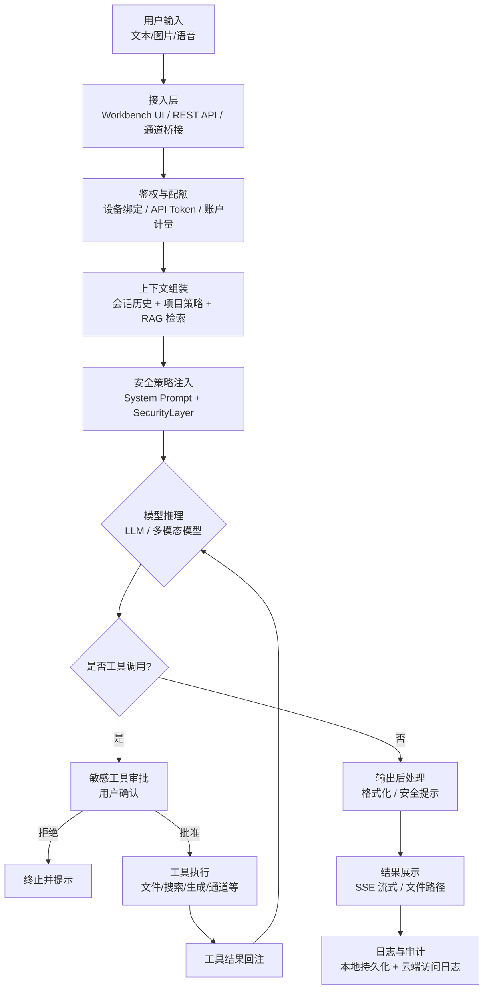

# 互联网信息服务算法安全自评估报告

**（生成合成类-服务提供者）**

---

## 封面信息

| 字段 | 内容 |
|------|------|
| **主体名称** | 杭州灵栖智能科技有限公司 |
| **统一社会信用代码** | 91330108MAE2L0B33H |
| **算法名称** | anyCode智能对话与多模态内容生成算法 |
| **算法类型** | ☑ 生成合成类 |
| **算法应用领域** | 互联网信息服务—智能对话、文本/代码生成、图像生成、视频生成、语音合成与识别 |
| **算法使用场景** | 面向开发者与技术工作者的 AI 工作台：智能问答、代码辅助、文档生成、多模态内容生成、项目知识检索、自动化任务编排；服务入口为 https://anycode.work 及 anyCode.app 内嵌 Digital Workbench |
| **算法上线情况** | ☐ 已上线，时间：____ ☑ **未上线，正在内测阶段**（anyCode Cloud 内测，2026年7月约30名注册用户） ☐ 未上线，正在开发阶段 |
| **自评估时间** | 2026 年 7 月 |
| **报告撰写时间** | 2026 年 7 月 9 日 |

### 算法基本情况（150 字内）

anyCode 智能对话与多模态内容生成算法，基于大语言模型与智能体编排技术，为用户提供对话问答、代码辅助、文本/图像/视频生成等服务。算法通过 AgentRuntime 编排模型推理与工具调用，经 anyCode Cloud 网关或用户 BYOK 端点完成生成；配套安全审批、日志审计与内容提示机制，主要应用于研发效率提升场景。

### 算法备案类型

☑ 算法未备案  
☐ 算法已备案，备案编号：  
☐ 备案已注销，备案编号：  
☐ 其他

### 附件引用

- **拟公示内容**：「anyCode 智能对话与多模态内容生成算法」拟公示内容（见附件 `algorithm-filing-public-disclosure.md`）
- **主体责任**：「【主体名称】」落实算法安全主体责任基本情况（需另行准备附件，见文末清单）

---

## 评估算法描述

### 1. 算法简介

本算法是 anyCode 产品的核心智能能力，包含对话生成、代码/文本合成、图像生成、视频生成、语音转写与合成等生成合成类功能。技术实现为 Rust 编写的 `AgentRuntime`，采用「LLM 推理 + 工具调用」多轮循环架构；云端服务通过 `https://anycode.work/v1/chat/completions` 等 OpenAI 兼容接口对外提供托管模型（默认 `agnes-chat`）。桌面端 anyCode.app 在本地 `127.0.0.1:43180` 嵌入 Digital Workbench，Agent 与工具默认在用户设备执行。

### 2. 应用范围

- **境内服务范围**：anyCode Cloud 账户注册、登录、模型调用、用量计量；anyCode.app 下载与更新（anycode.work/downloads）。
- **功能范围**：工作台对话、代码辅助、知识库 RAG、图像/视频生成、语音处理、定时自动化、微信/Telegram/Discord 通道桥接（用户自部署 daemon）。
- **不在范围**：公域内容推荐流、广告算法、面向公众的 UGC 社区排序。

### 3. 服务群体

- 软件开发人员、技术团队、独立开发者；
- 需要本地/私有环境运行 AI 工作流的企业用户；
- 通过 anyCode Cloud 使用托管模型的个人订阅用户（Free/Pro/Team）。

### 4. 用户数量

| 阶段 | 估计 |
|------|------|
| 当前（内测） | 注册用户约 **30** 人，日活约 **8** 人（2026年7月统计） |
| 正式上线后（12 个月内预估） | 注册用户 **5,000** 以内，日活 **500** 以内 |

### 5. 社会影响情况

- **正面**：提升软件研发与知识工作效率，支持本地化部署与 BYOK，有利于数据合规与自主可控。
- **潜在影响**：若生成内容未经甄别被用于传播虚假信息、侵权内容或恶意代码，可能产生不良社会影响；已通过审批机制、用户告知与内容提示降低风险。
- **舆论与监管**：产品不提供公众舆论引导或热点推送，社会影响面主要限于注册用户的工作场景，预计中等偏低。

### 6. 软硬件设施及部署位置

| 组件 | 部署 |
|------|------|
| anyCode Cloud 门户 / 账户服务 / model-gateway | 阿里云容器服务（华东，如 cn-zhangjiakou），镜像 `registry.cn-zhangjiakou.aliyuncs.com/818cloud/anycode` |
| anyCode.app（macOS） | 用户本地安装，Tauri 壳 + 内嵌 Workbench |
| anycode-daemon | 用户自托管（Linux/Windows/NAS/云主机） |
| 会话与配置数据 | 默认存储于用户本地 `~/.anycode/` |
| 第三方 LLM API | 按用户配置或云端路由调用（如 Agnes、智谱、DeepSeek、通义千问等） |

### 7. 其他

- 开源代码托管于 GitHub（qingjiuzys/anycode），MIT 许可；算法备案针对运营主体提供的互联网信息服务，而非开源代码分发本身。
- 产品无训练自有基础大模型，不涉及大规模训练数据采集。

---

## 评估算法风险描述

| 风险类型 | 描述 |
|----------|------|
| **1. 算法滥用风险** | 用户可能诱导模型生成恶意代码、钓鱼脚本、虚假宣传文案或规避安全策略的内容。 |
| **2. 算法被恶意利用风险** | 攻击者可能通过 API 批量调用生成违规内容，或利用自动化通道（微信桥）传播生成结果。 |
| **3. 算法漏洞风险** | 多轮工具调用链可能存在提示注入（Prompt Injection），导致非预期文件操作或外链访问；流式输出难以及时中断有害内容。 |
| **4. 违法和不良信息生成风险** | 模型可能生成涉政、色情、暴力、谣言、侵权等违法违规或不良信息。 |
| **5. 违法和不良信息存储风险** | 会话历史、生成文件存于用户本地或运营方日志，若缺乏留存策略可能导致违规内容持久化。 |
| **6. 违法和不良信息传播扩散风险** | 用户可通过 SendMessage、微信/Telegram/Discord 桥接将生成内容外发，形成传播链路。 |
| **7. 数据和用户信息泄露风险** | API Key、会话内容、项目代码经模型 API 传输；云端账户信息存储于账户服务数据库。 |
| **8. 其他违法违规风险** | 图像/视频生成可能被用于深度合成虚假信息；需符合深度合成相关标识与审核要求。 |

---

## 真实性声明

我方承诺：提供的所有材料准确、真实、合法、有效，并愿为此承担有关法律责任。

| 字段 | 内容 |
|------|------|
| **算法安全负责人（签名）** | 鲁家伟 |
| **联系电话** | 17319329356 |

---

# 一、算法情况

## （一）算法流程

以下为算法服务链路（节点粒度 ≤ 单个模型或干预策略）：

**文字说明**：

1. 用户经 Workbench、API 或消息通道提交输入；
2. 接入层完成身份鉴权（anyCode Cloud 设备链接或本地 API Token）；
3. AgentRuntime 组装 Prompt（含历史、知识库、系统指令）；
4. SecurityLayer 注入安全策略；
5. 调用 LLM（云端 agnes-chat 或用户 BYOK 端点）流式生成；
6. 若触发工具调用，敏感操作经用户审批后执行，结果回注模型；
7. 输出经格式化与安全提示后展示，并记录审计日志。

## （二）算法数据

> 本算法无自研模型训练环节；以下描述推理阶段数据。

### 1. 对话文本类输入数据

| 属性 | 说明 |
|------|------|
| **模态** | 文本（UTF-8）、可选图片（PNG/JPEG/WebP）、可选语音（WAV/MP3 等） |
| **语种** | 中文、英文为主，支持多语种混合 |
| **生物特征** | 不涉及指纹、人脸特征提取用于识别；图片输入仅用于 Vision 理解或 OCR，不进行人脸比对 |
| **来源** | 用户主动输入、通道转发消息、API 调用方提交 |
| **典型大小** | 单条文本 ≤ 32KB；图片 ≤ 10MB；语音 ≤ 25MB |

### 2. 对话与生成类输出数据

| 属性 | 说明 |
|------|------|
| **模态** | 文本（Markdown/代码）、图片（PNG/WebP）、视频（MP4）、音频（WAV/MP3） |
| **语种** | 与输入一致或用户指定 |
| **格式** | 文本流式 JSON/SSE；媒体文件存于用户本地 `~/.anycode/` 或项目目录 |
| **典型大小** | 文本回复 ≤ 64KB/轮；图片 ≤ 5MB；视频 ≤ 100MB |

### 3. 知识检索类输入数据（RAG）

| 属性 | 说明 |
|------|------|
| **模态** | 文本（项目文档、Markdown、代码片段） |
| **来源** | 用户配置的项目知识路径，本地索引 |
| **规模** | 单项目 ≤ 10,000 文档片段（可配置） |

### 4. 训练数据

**无。** 本服务不训练基础大模型，不采集数据用于模型权重更新。第三方模型提供方的训练数据由其自行合规管理。

### 5. 日志与审计数据

| 属性 | 说明 |
|------|------|
| **内容** | 请求时间、账户 ID、模型名称、Token 用量、错误码；不默认存储完整 Prompt |
| **存储** | 云端日志保留 **【90】** 天；本地会话由用户自行管理 |
| **位置** | 阿里云 K8s 集群日志系统；本地 `~/.anycode/tasks/` |

## （三）算法模型

> 以下为算法流程中涉及的模型节点；基础权重由第三方提供，anyCode 负责编排与调用。

### 1. anyCode 对话生成模型（云端托管）

| 字段 | 内容 |
|------|------|
| **模型名称** | agnes-chat（anyCode Cloud 默认对话模型） |
| **版本** | 由上游模型服务版本决定，网关配置 `007_seed_agnes_model.sql` 管理 |
| **模型类型** | 基于 Transformer 的大语言模型（具体架构由上游提供方维护） |
| **功能** | 多轮对话、工具调用决策、代码与文本生成 |
| **优化目标** | 指令遵循、工具调用准确率、中文/英文对话质量 |
| **评价指标** | 内测场景通过率、用户反馈、网关错误率 &lt; 1% |
| **更新策略** | 上游模型升级时，经运营方测试后更新网关路由配置，滚动发布 |
| **数据情况** | 不本地训练；推理数据经 HTTPS 传输，不落盘用于训练 |

### 2. 用户 BYOK 对话模型（可选）

用户可配置 z.ai/智谱 GLM、DeepSeek、通义千问、OpenAI、Anthropic 等 40+ 提供商端点。anyCode 作为客户端编排调用，模型机理与合规义务由对应提供方承担。配置路径：`~/.anycode/config.json`。

### 3. 多模态生成模型

| 模型用途 | 调用方式 | 说明 |
|----------|----------|------|
| 文生图 | GenerateImage 工具 → 用户配置的 image 模型 | 用户主动触发 |
| 文生视频 | GenerateVideo 工具 → 如 agnes-video-v2.0 | 用户主动触发，异步轮询任务状态 |
| 语音识别 | SpeechToText / Apple Speech（macOS 本地） | 桌面端可完全本地执行 |
| 语音合成 | TextToSpeech → 用户配置的 TTS 模型 | 用户主动触发 |
| 图文理解 | Vision 能力模型 | 分析用户上传图片 |

### 4. 向量检索模型（RAG）

| 字段 | 内容 |
|------|------|
| **模型** | FastEmbed（如 BGE-zh、MiniLM）或 Ollama embedding |
| **功能** | 将知识库文档编码为向量，支持语义检索 |
| **部署** | 默认本地推理，可选远程 embedding API |
| **训练** | 使用公开预训练嵌入模型，无额外训练 |

### 5. 预处理与后处理

- **预处理**：Prompt 截断与压缩（auto-compaction）、工具 schema 规范化、图片 base64 编码、语音格式转换。
- **后处理**：Markdown 渲染、流式 SSE 封包、错误码映射、敏感工具结果摘要。

## （四）干预策略

### 1. 安全策略注入（预处理）

| 字段 | 内容 |
|------|------|
| **策略形式** | 自动 + 可配置规则 |
| **策略目标** | 限制危险命令、外链访问、敏感工具未经审批执行 |
| **生效时间** | 每次请求前注入 System Prompt 与 SecurityLayer 策略 |
| **影响范围** | 全部 Agent 会话 |
| **依据** | 《互联网信息服务算法推荐管理规定》及内部安全规范；`SecurityPolicy` deny/allow 正则规则 |
| **实现** | `crates/security` SecurityLayer；`SECURITY_SENSITIVE_TOOL_IDS` 登记敏感工具 |

### 2. 敏感工具用户审批

| 字段 | 内容 |
|------|------|
| **策略形式** | 人工确认（Workbench 弹窗 / 微信审批 / TUI） |
| **策略目标** | 文件写入、命令执行、外链、消息外发、浏览器自动化等操作需用户明确授权 |
| **覆盖工具** | Edit、Bash、WebFetch、GenerateImage、SendWeChatMessage 等 30+ 敏感工具 |
| **默认** | `require_approval: true` |

### 3. 内容安全提示（后处理）

| 字段 | 内容 |
|------|------|
| **策略形式** | 自动 |
| **策略目标** | 在 UI 提示「AI 生成内容，请审慎甄别」；对明显违规请求返回拒绝说明 |
| **审核方式** | 云端网关可对接上游模型内置安全过滤；本地记录异常请求 |

### 4. 配额与访问控制

| 字段 | 内容 |
|------|------|
| **策略形式** | 自动 |
| **策略目标** | 按订阅套餐限制 Token 用量；API Token 鉴权；设备绑定防滥用 |
| **失效估计** | 持续有效，随账户策略调整 |

## （五）结果标识

### 1. 显式标识

| 字段 | 内容 |
|------|------|
| **是否具备** | 是 |
| **标识方法** | Workbench 对话界面展示模型名称；生成内容区域标注 AI 生成提示 |
| **是否显著** | 是，位于对话气泡上方/设置页 |
| **是否可篡改** | 用户可截图传播，服务侧标识不可被普通用户关闭（合规提示常驻） |
| **标识位置** | 工作台 UI、anycode.work 用户协议 |

### 2. 隐式溯源标识

| 字段 | 内容 |
|------|------|
| **是否具备** | 部分具备 |
| **实现** | 会话与任务记录含 `session_id`、`task_id`、时间戳、模型版本；云端日志含 `request_id` |
| **溯源能力** | 运营方可据日志追溯特定账户、时间的模型调用记录，用于投诉处理与监管配合 |

---

# 二、服务情况

## 1. anyCode Cloud 智能对话服务

| 字段 | 内容 |
|------|------|
| **服务简介** | 面向注册用户的托管大模型对话服务。用户登录 anycode.work 后，在 anyCode.app 或 Workbench 选择「云端 Auto / agnes-chat」进行对话。展现形态为桌面/Web 工作台聊天界面。入口：应用首页 → 新建会话。 |
| **上线时间** | 【内测中，拟于 2026 年 Q3 正式上线】 |
| **服务流量** | 内测阶段日均请求 **【100–500】** 次（请按实际填写） |
| **用户情况** | 见「评估算法描述 §4」 |

**算法在服务中应用情况**：

- **线上数据来源**：用户实时输入的对话消息；不采集公网 UGC 作为推理输入。
- **训练数据来源**：无自研训练。
- **数据形态**：HTTPS JSON API，SSE 流式响应。
- **算法更新频率**：编排逻辑随客户端版本更新（约每月 1–2 次）；模型版本随网关配置更新（按需）。
- **共享情况**：会话数据默认不与其他应用共享；用量数据同步至账户服务用于计费。

## 2. anyCode Digital Workbench 本地对话服务

| 字段 | 内容 |
|------|------|
| **服务简介** | 运行于用户本地的 Web 工作台（`127.0.0.1:43180`），提供完整 Agent 对话与工具执行。可独立使用 BYOK 模型，不依赖云端推理。 |
| **算法应用** | 同上 AgentRuntime；模型端点由用户配置。 |
| **数据** | 全部本地处理，仅 LLM API 调用出网。 |

## 3. 多模态生成服务（图像/视频/语音）

| 字段 | 内容 |
|------|------|
| **服务简介** | 用户在工作台对话中主动请求生成图片、视频或语音时，Agent 调用 GenerateImage / GenerateVideo / TextToSpeech 等工具。 |
| **触发方式** | 仅用户明确指令触发，无自动批量生成。 |
| **审核** | 纳入敏感工具审批策略（如配置）；生成结果返回本地路径。 |

---

# 三、风险研判

## （一）算法滥用

**风险描述**：用户可能利用对话生成恶意代码、虚假宣传、侵权内容，或绕过审批（`--ignore-approval`）执行危险操作。

**影响分析**：可能造成用户设备受损、第三方权益侵害或不良信息传播；因服务面向技术用户且默认审批，滥用概率可控。

**现有缓解**：默认 `require_approval: true`；敏感工具清单；用户协议禁止违法使用；云端用量监控异常检测（【待完善】）。

## （二）算法漏洞

**风险描述**：Prompt Injection 可能诱导模型执行非预期工具调用；多轮循环可能放大错误。

**影响分析**：可能导致 unintended 文件修改或数据外发；影响范围限于用户授权的项目目录。

**现有缓解**：工具参数展示供用户审批；`sandbox_mode` 可选路径限制；子 Agent 深度限制。

## （三）算法恶意利用

**风险描述**：API Token 泄露后可被第三方批量调用；自动化通道可被用于垃圾消息发送。

**影响分析**：增加云端成本与违规内容生成风险。

**现有缓解**：API Token 可撤销；账户设备绑定；速率限制【建议上线前配置】；异常 IP 封禁【建议上线前配置】。

## 其他风险

- **深度合成**：文生视频需遵守深度合成标识要求——已在用户协议中提示，拟在视频输出文件元数据/文件名加入生成标识【待完善】。
- **未成年人**：产品面向成年专业用户，注册需同意用户协议；不面向未成年人主动推广。

---

# 四、风险防控情况

## （一）风险防范机制建设

### 1. 算法机制机理审核

参见附件：「【主体名称】」落实算法安全主体责任基本情况。

**补充说明**：

- 产品迭代前由技术负责人审查 Agent 工具目录变更（`SECURITY_SENSITIVE_TOOL_IDS`）；
- 云端模型路由变更需经 staging 验证与负责人签字；
- **有效防控风险**：算法滥用、算法漏洞、恶意利用、违法信息生成。

### 2. 算法安全评估监测

参见附件：「【主体名称】」落实算法安全主体责任基本情况。

**补充说明**：

- 内测期间每周审查云端错误日志与投诉邮箱（【建议设立 security@anycode.work】）；
- 每季度更新本自评估报告；
- **有效防控风险**：违法信息生成/传播、数据泄露、算法滥用。

### 3. 对生成合成虚假信息的辟谣机制

参见附件。

**补充说明**：

- 在 anycode.work 提供用户反馈/举报入口；
- 接到举报后 24 小时内核查日志，对违规账户暂停服务；
- **有效防控风险**：违法信息传播、算法滥用。

### 4. 算法安全事件应急处置

参见附件。

**补充说明**：

- 事件分级：P0 大规模违规内容 / 数据泄露 → 1 小时内暂停相关 API；
- 成立应急小组（技术 + 法务 + 客服）；
- 按监管要求 24 小时内报送；
- **有效防控风险**：全部 8 类风险。

## （二）用户权益保护

### 1. 用户知情权

- 用户注册时展示《用户协议》《隐私政策》，说明算法用途、第三方模型调用、数据存储位置；
- Workbench 设置页展示当前模型与提供方，与公示内容一致；
- 收集账户邮箱、设备信息用于鉴权，经用户同意；
- **有效防控风险**：数据泄露、算法滥用。

### 2. 用户个人信息保护

- 遵循《个人信息保护法》：最小必要收集；账户数据加密存储；不向第三方出售用户数据；
- LLM 推理时仅传输当前会话必要上下文，不上传用户完整磁盘数据；
- API Key（BYOK）仅存本地 `~/.anycode/credentials/`；
- 与第三方模型提供方共享：仅推理请求内容，通过 HTTPS，无另案审批（用户自选提供方时视为用户授权）；
- **有效防控风险**：数据泄露。

### 3. 其他权益保护

- 《消费者权益保护法》：订阅服务提供用量明细与退款政策；
- 不涉及劳动、交通等特殊法规领域；
- **有效防控风险**：其他违法违规风险。

## （三）内容生态治理

### 1. 防范和抵制违法违规不良信息

- System Prompt 约束模型拒绝明显违法请求；
- 上游模型安全策略（Agnes/智谱等）作为第一道过滤；
- 用户举报通道 + 人工复核；
- **有效防控风险**：违法信息生成、存储、传播。

### 2. 人工审核

- **当前状态**：内测阶段对投诉举报个案进行人工审核；未对全量对话进行人工审核（用户私密对话场景）。
- **计划**：正式上线后，对云端 API 异常高频账户进行抽样审核【建议补充制度】；
- **与机器审核结合**：机器（上游过滤 + 本地策略）为主，人工处理举报与异常；
- **有效防控风险**：违法信息生成与传播。

## （四）模型安全保障

### 1. 供应链安全

- 仅接入具备合规资质的云模型 API；
- 网关与客户端 HTTPS 全链路；
- 定期更新依赖，修复已知 CVE；
- **有效防控风险**：算法漏洞、恶意利用。

### 2. 防投毒（推理侧）

- 无自训练，模型投毒风险在 upstream；
- 对用户上传知识库文件做格式校验，防恶意超大文件 DoS；
- **有效防控风险**：算法漏洞。

## （五）数据安全防护

- 训练数据：不涉及。
- 推理数据：TLS 传输；云端数据库加密存储；访问权限最小化；
- 第三方共享：仅用户选择的 LLM API 提供方；签订数据处理协议【建议与上游签署 DPA】；
- 本地数据：用户自行备份与删除，`~/.anycode/` 目录权限受 OS 保护。

---

# 五、安全评估结论

经自评估，本算法在**内测阶段**已建立与用户场景匹配的基础安全机制：敏感工具审批、身份鉴权、日志审计、用户告知与内容提示。主要残余风险为违规内容生成与 API 滥用，拟在正式上线前补充：全量速率限制、异常检测、举报工单流程、视频生成显式标识完善。

**结论**：在落实附件「算法安全主体责任基本情况」及上述待完善项后，风险总体**可控**，具备申请算法备案条件。

---

# 六、其他应当说明的相关情况

1. **与自研/开源客户端的关系**：anyCode 桌面端与 daemon 为开源/分发客户端，核心备案对象为运营主体在境内提供的 **anyCode Cloud 互联网信息服务**。用户纯 BYOK 本地使用、不经云端推理时，生成合成能力由用户所选第三方模型提供方承担相应义务。

2. **多个应用统一备案**：anyCode.app、Digital Workbench、anycode-daemon 通道桥接均调用同一套「anyCode 智能对话与多模态内容生成算法」，建议**合并为一次备案**，无需按客户端拆分。

3. **818Cloud Console**：`console.818cloud.com` 为账户控制平面（登录、订阅、计费），不独立提供生成合成算法服务，纳入同一主体备案说明即可。

4. **待用户补充材料**（附件，非本报告正文）：
   - 营业执照复印件
   - 算法安全主体责任落实情况（组织架构、制度、应急预案）
   - 算法安全负责人任命书
   - 用户协议、隐私政策（含算法说明章节）
   - 内测/上线截图（Workbench 对话页、设置页模型展示、审批弹窗）

---

*文档版本：v1.0 | 生成日期：2026-07-09 | 路径：`docs/ops/algorithm-filing-self-assessment.md`*
