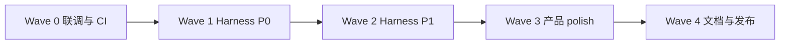

# anyCode 套件收口规划（2026-06）

**目的：** 在 WorkBuddy 对标 Phase 1–3 已基本落地的前提下，用 **可验收的波次** 收掉剩余 Partial / 未验项，把「大套件」推到 **可对外宣称 MVP+ 闭环** 的状态，再进入 Tier 2（Connector 写回 / SSO）讨论。

**边界（本规划内不做）：** 飞书/钉钉/企微/QQ、腾讯 Credits/文档 OAuth、Gateway/云 relay、多机集群、SSO/RBAC、Connector 写回。见 [workbuddy-comparison-2026-06.md](../comparisons/workbuddy-comparison-2026-06.md)「明确不做」。

**关联 SSOT：**

| 文档 | 角色 |
|------|------|
| [workbuddy-comparison-2026-06.md](../comparisons/workbuddy-comparison-2026-06.md) | WorkBuddy 七域差距矩阵 |
| [production-harness-hardening.md](production-harness-hardening.md) | Harness M0–M8 技术里程碑 |
| [roadmap.md](../roadmap.md) | 维护者 backlog 索引 |
| [digital-workbench-next-steps-zh.md](../workbench/digital-workbench-next-steps-zh.md) | Workbench Tier 1.5–3 |

---

## 1. 当前套件快照

### 1.1 已具备（可对外描述）

| 套件 | 能力 |
|------|------|
| **运行时** | 单一 `AgentRuntime`；CLI REPL / run / goal / workflow / cron；BYOK 多 Provider |
| **工具** | 内置工具 + 可选 MCP/LSP；Skills install/vet；KnowledgeSearch |
| **专家** | 8–12 declarative 办公 preset + Dashboard Agent 编辑 |
| **资料库** | `knowledge.paths` + SQLite + BM25；可选 `knowledge-embeddings` |
| **自动化** | Cron GUI/API、模板、重试、`cron-runs.jsonl`、NL 启发式 schedule |
| **IM** | 个人微信 iLink（生命周期 + CDN 出站代码）；Telegram/Discord |
| **控制面** | Digital Workbench V3、Tauri sidecar、eval/doctor、Conversations 预算筛选 |
| **安全** | SecurityLayer、审批、audit、skill-vetter |

### 1.2 未收口项（本规划要消灭）

| ID | 项 | 现状 | 收口目标 |
|----|-----|------|----------|
| **G1** | 微信 CDN 文件 outbound | 代码 Done，**未 live 验** | live iLink 清单全绿或文档化已知限制 |
| **G2** | Production Harness M1 trace | Partial | 全主路径 emit 统一 `events.jsonl` 字段，Dashboard 可读 |
| **G3** | Harness M2 runtime budget | Partial | strict 模式下超预算 **hard-stop** 下一 tool |
| **G4** | Harness M3 trajectory eval | Partial（fixture + guard 已有） | CI 含 budget trip / gate fail 负向场景 |
| **G5** | Harness M4 tool governance | 未做 | 默认工具 catalog 带 risk/approval/category 元数据 + 测试 |
| **G6** | Harness M5 MCP governance | 未做 | strict 白名单 + per-server quota（feature 或 config 门控） |
| **G7** | Harness M6 workflow 校验 | 弱 | 执行前校验 agent/tool/gate/无环依赖 |
| **G8** | Harness M7–M8 memory/UI | retention API v1 | evidence provenance + Workbench 解释 retention 结果 |
| **G9** | NL→cron | 启发式 Done | 文档定级为 v1；或可选 LLM 解析（二选一，见 Wave 3） |
| **G10** | `knowledge-embeddings` | 可选 feature | CI 编译 job + 文档「如何启用」 |
| **G11** | 桌面/Tauri | sidecar Done | release smoke + 可选签名 secrets 文档对齐 CI |
| **G12** | Discord/微信 AskUserQuestion | Telegram 已有 | ADR 008 阶段 1：文本回落或明确 Later |

---

## 2. 收口完成定义（Exit Criteria）

满足 **全部** 下列条件，即宣告 **「2026-06 套件收口完」**：

1. **WorkBuddy 矩阵**：七域无 **Partial** 行；仅剩 **Skip** / **Later** / **Done**（见 comparison 文档同步）。
2. **微信 G1**：完成 [§4.1 联调清单](#41-微信-cdn-联调清单) 或 ADR 记录「iLink 限制下的降级策略」。
3. **Harness P0（G2–G4）**：`production-harness-hardening.md` M1–M3 验收标准逐条可演示；`anycode eval run --mock` + `scripts/eval/run.py --with-mock` CI 绿。
4. **Harness P1（G5–G7）**：M4–M6 最小实现 + 单元/集成测试；无新 public trait（ADR 000）。
5. **记忆 G8**：`memory prune --dry-run` 与 Dashboard retention 面板结果一致；audit 有 `memory_retention_apply`。
6. **发布**：`cargo build --release -p anycode`；comparison + CHANGELOG 更新；doctor `all` 无新增红色项。

**不在此轮 Exit 内：** SSO、Connector 写回、多机 RemoteTrigger、140+ 专家、SkillHub 运营。

---

## 3. 波次执行（推荐顺序）



### Wave 0 — 联调与 CI 基线（≈3–5 天）

| 任务 | 交付 | 验收 |
|------|------|------|
| G1 微信 CDN live | 联调记录 + 必要时 fallback 文案 | §4.1 清单 |
| G10 embeddings CI | `.github/workflows/ci.yml` 增加 `cargo check -p anycode-tools --features knowledge-embeddings` | CI 绿 |
| G11 桌面 smoke | `scripts/build-desktop-release.sh` + README 步骤 | macOS 本地能开 sidecar 并 `run` |

### Wave 1 — Harness P0 收口（≈2 周）

**原则：** 先 trace，再 budget，再 eval；不并行开第二套执行引擎。

| 任务 | 主要文件 | 验收 |
|------|----------|------|
| **G2 M1 trace SSOT** | `crates/agent/src/runtime/logging.rs`、`execute_turn.rs`、Dashboard ingest | run/repl/cron 均写同一 schema 的 `events.jsonl`；Dashboard 会话时间线可展示 tool/llm/budget |
| **G3 M2 runtime budget** | `runtime_options.rs`、`execute_tool.rs`、Dashboard budget facet | strict 配置下超 token/tool 预算 emit `budget_exceeded` 且 **不再发起 tool** |
| **G4 M3 eval 负向** | `eval_mock.rs`、`scenarios.json`、`run.py` | 新增 `mock-fixture-budget-trip`（或 synthetic guard）；CI 失败时能定位 trajectory |

**Wave 1 完成检查：**

```bash
cargo test -p anycode --test eval_mock
python3 scripts/eval/run.py --with-mock
cargo test -p anycode-dashboard --test fixture_api
```

### Wave 2 — Harness P1 治理（≈2 周）

| 任务 | 主要文件 | 验收 |
|------|----------|------|
| **G5 M4 tool metadata** | `crates/tools/src/catalog.rs`、`registry.rs` | 每个 `DEFAULT_TOOL_IDS` 有 risk/category；缺 metadata 测试 fail |
| **G6 M5 MCP governance** | `mcp_*`、`bootstrap/runtime.rs`、Dashboard settings | config `mcp.strict_whitelist` + 配额计数；超配额 trace 事件 |
| **G7 M6 workflow 校验** | `tasks_workflow.rs`、`crates/core` plan types | 未知 agent / 禁用 tool / 环依赖 → 执行前 Err |

### Wave 3 — 产品 polish（≈1 周）

| 任务 | 决策 | 验收 |
|------|------|------|
| **G9 NL→cron** | **A（推荐）**：文档定级 v1 heuristic，Dashboard 提示「规则解析，非 LLM」 | comparison + UI 文案 |
| | **B**：可选 `ANYCODE_CRON_NL_LLM=1` 调本地模型 parse | 需 API key 与 timeout 测试 |
| **G8 M7–M8** | retention summary 进 Workbench Settings；provenance 字段进 memory doctor | 与 CLI `memory prune --json` 一致 |
| **G12 AskUserQuestion** | Discord/微信：文本选项回落（ADR 008 phase 1）或 comparison 标 Later | ADR 或 comparison 更新 |

### Wave 4 — 文档与发布（≈3 天）

| 任务 | 交付 |
|------|------|
| 更新 [workbuddy-comparison-2026-06.md](../comparisons/workbuddy-comparison-2026-06.md) | 收口状态、G1/G9 结论 |
| 更新 [roadmap.md](../roadmap.md) §2 最近已交付 | 收口摘要 + 链到本文 |
| CHANGELOG | 用户可见特性与 breaking（若有） |
| Release | `cargo build --release -p anycode`；tag 可选 |

---

## 4. 联调与运维清单

### 4.1 微信 CDN 联调清单

- [ ] iLink 登录态有效（`anycode channel status` 绿）
- [ ] 小文件（&lt;1MB `.md`）CDN upload + `file_item` 收到
- [ ] 出站视频（如 `mountain_lake.mp4` ~870KB）CDN 直发，非路径回退（需 `base_info` + `iLink-App-*` 头，2026-06-15 已补齐代码）
- [ ] 接近 10MB 边界文件行为（成功或明确错误码）
- [ ] CDN 失败时 fallback 文本含具体原因 + 本地路径（`deliverable.rs`）
- [ ] 输出中的 `https://...mp4` 远程 URL 自动下载后 CDN 发送
- [ ] cron 交付物路径与交互式 run 一致
- [ ] 结果写入 comparison 文档「G1 结论」段

### 4.2 Doctor 收口检查

```bash
anycode doctor all --json
anycode doctor errors --json   # 无新增未文档化 error code
```

期望：skills / knowledge / wechat / cron 子项与 Workbench doctor 一致。

### 4.3 CI 最小集（收口 PR 必过）

```bash
cargo fmt --all -- --check
cargo clippy --workspace --all-targets
cargo test --workspace
cargo check -p anycode-tools --features knowledge-embeddings
python3 scripts/eval/run.py --with-mock
cargo build --release -p anycode
```

---

## 5. 风险与取舍

| 风险 | 缓解 |
|------|------|
| iLink CDN 环境不可用 | Wave 0 限时 3 天；超时则 ADR「CDN v2 待验，v1 文本+路径」 |
| Harness 范围膨胀 | 严格按 M1→M3→M4→M6 顺序；M8 UI 只做解释性面板，不做新页面风暴 |
| FastEmbed CI 慢 | 仅 `cargo check` feature job，不进默认 release 路径 |
| NL→cron LLM 拖期 | 默认选 Wave 3 决策 **A**（文档定级），不阻塞收口 |

---

## 6. 收口后状态（目标叙事）

**对用户：** 个人微信可遥控办公 Agent；Dashboard 可配专家、资料库、定时任务；BYOK 自备模型；可选桌面壳。

**对维护者：** 单一 Runtime + 可 CI 的 trajectory eval + trace/budget 可观测 + 工具/MCP 最小治理；WorkBuddy 对标文档无 Partial。

**下一章（Tier 2，单独立项）：** Connector OAuth 写回、SSO、Browser gate、跨进程 durable 后台 Agent。

---

## 7. 任务跟踪表（可复制到 issue）

| Wave | ID | 标题 | Owner | 状态 |
|------|-----|------|-------|------|
| 0 | G1 | 微信 CDN live 联调 | | ☐ |
| 0 | G10 | embeddings CI job | | ☑ |
| 0 | G11 | Tauri release smoke | | ☑ |
| 1 | G2 | M1 execution trace SSOT | | ☑ |
| 1 | G3 | M2 runtime budget hard-stop | | ☑ |
| 1 | G4 | M3 eval 负向 fixture | | ☑ |
| 2 | G5 | M4 tool governance metadata | | ☑ |
| 2 | G6 | M5 MCP strict + quota | | ☐ |
| 2 | G7 | M6 workflow preflight | | ☑ |
| 3 | G8 | M7–M8 memory provenance + UI | | ☐ |
| 3 | G9 | NL→cron 定级 A 或 B | | ☐ |
| 3 | G12 | AskUserQuestion 通道扩展 | | ☐ |
| 4 | — | 文档 + CHANGELOG + release | | ◐ |

**状态图例：** ☐ 未开始 · ◐ 进行中 · ☑ 已验收

---

*最后更新：2026-06 · 维护者：qingjiu*
