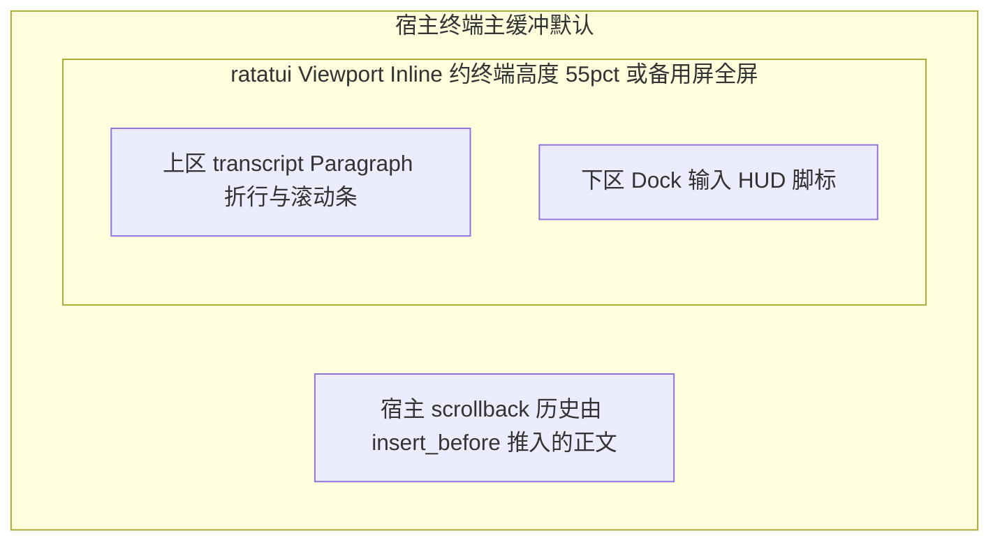
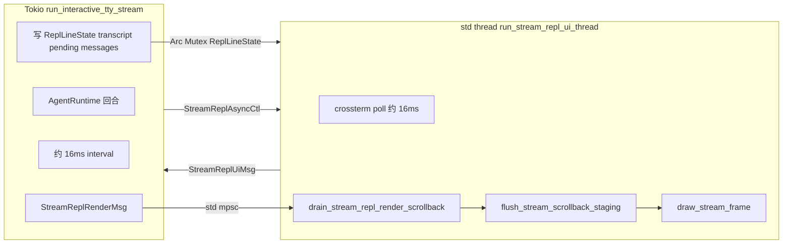

# Stream REPL 当前页面结构（自上而下）

面向维护者：描述 `anycode repl` 在 TTY 流式模式下的**终端分区**、**ratatui 单帧竖直布局**、**Dock 内部栈**与 **Tokio / UI 线程**数据流。实现入口见 [`crates/cli/src/tasks/tasks_repl.rs`](../crates/cli/src/tasks/tasks_repl.rs) 的 `run_interactive_tty_stream`（主 `select!` 与斜杠分发）、[`crates/cli/src/tasks/stream_repl_loop.rs`](../crates/cli/src/tasks/stream_repl_loop.rs)（审批/选题 drain、回合摘要过期、执行态 `transcript` tick、`StreamReplRenderMsg` scrollback 发送）与 [`crates/cli/src/repl/stream_ratatui.rs`](../crates/cli/src/repl/stream_ratatui.rs) 的 `run_stream_repl_ui_thread`。

### 重构边界（不变量）

Stream REPL 栈可以演进通道与文件拆分，但须遵守：

- **编排权威**（[ADR 000](adr/000-runtime-orchestration.md)）：多轮 LLM+工具仍只经 `AgentRuntime`，不另起第二套执行引擎。
- **组合根**（[ADR 002](adr/002-cli-composition-root.md)）：runtime 仍由 `initialize_runtime` 组装。
- **协作取消**：`Arc<AtomicBool>` 与 `CoreError::CooperativeCancel` 语义不变。

### 通道与类型依赖（只读清单）

| 符号 | 方向 | 定义位置 |
|------|------|----------|
| `StreamReplUiMsg` | UI → Tokio（`UnboundedSender`） | [`crates/cli/src/repl/stream_ratatui.rs`](../crates/cli/src/repl/stream_ratatui.rs) |
| `StreamReplAsyncCtl` | Tokio → UI（`std::sync::mpsc`） | 同上 |
| `StreamReplRenderMsg` | Tokio / `ReplSink::Stream` → UI（`std::sync::mpsc`） | [`crates/cli/src/repl/stream_render_msg.rs`](../crates/cli/src/repl/stream_render_msg.rs) |
| `ReplLineState`（含 `transcript`、`pending_*`） | Tokio 写为主，UI 读/写输入态 | [`crates/cli/src/repl/line_state.rs`](../crates/cli/src/repl/line_state.rs) |

历史：`ReplLineState::stream_scrollback_pending` 已移除，宿主 scrollback 增量改走 **`StreamReplRenderMsg::ScrollbackChunk`**（见 [`stream_repl_loop::send_scrollback_chunk`](../crates/cli/src/tasks/stream_repl_loop.rs)）。

---

## 依赖版本（工作区）

与常见「ratatui 0.28 + crossterm 0.28」教程栈不同，anyCode 工作区当前为：

- 根目录 [`Cargo.toml`](../Cargo.toml)：`ratatui = "0.24"`，`crossterm = "0.27"`（`[workspace.dependencies]`）。
- 无独立 `tui-textarea` / `ratatui-markdown` crate；多行输入在 [`crates/cli/src/tui/input/`](../crates/cli/src/tui/input/)，终端内 Markdown 辅助在 [`crates/cli/src/md_tui.rs`](../crates/cli/src/md_tui.rs) 等。

---

## 终端里「整屏」分两层心智模型

主缓冲默认下，**宿主 scrollback** 与 **ratatui Inline 视口**并存：长文执行路径经 `insert_before` 推入宿主历史；矩阵区仍由 ratatui 绘制。



（主缓冲下，`scroll` 在**空间上**位于 `inline` 视口**上方**；图中不画连线以免与子图 ID 解析混淆。）

说明：

- **主缓冲 + 非备用屏**：ratatui 使用 `Viewport::Inline`，高度约为终端可视行数的比例（默认约 55%，下限等见 [`stream_repl_inline_viewport_rows`](../crates/cli/src/repl/stream_term.rs)）。**视口上方**是终端已有滚动历史；执行中助手增量经 [`StreamReplRenderMsg`](../crates/cli/src/repl/stream_render_msg.rs) 送达 UI 线程，再经 [`flush_stream_scrollback_staging`](../crates/cli/src/repl/stream_term.rs) 内 **`Terminal::insert_before`** 写入宿主 scrollback（与「消息区完全画在 ratatui 单画布内」的教程架构不同）。
- **备用屏**（`ANYCODE_STREAM_REPL_ALT_SCREEN` 等与配置对齐）：整块为 ratatui 全屏，无上述「视口之上宿主分区」划分。

---

## ratatui 一帧内：从上到下（[`stream_paint.rs`](../crates/cli/src/repl/stream_paint.rs)）

`draw_stream_frame` 在 `terminal.draw` 闭包内对当前 `area = f.size()` 做**竖直二分**（先清缓冲再画）：

| 从上 → 下 | 约束 | 内容 |
|-----------|------|------|
| **上格** `top_cell` | `Constraint::Min(1)` | `transcript` → `prepare_stream_transcript_paragraph` → `Paragraph`；宽度 ≥ 2 时右侧 **1 列** scrollbar（[`render_stream_scrollbar`](../crates/cli/src/repl/stream_viewport.rs)） |
| **下格** `dock_screen` | `Constraint::Length(dock_h)` | 离屏 `Buffer` 上 [`render_repl_dock_to_buffer`](../crates/cli/src/repl/dock_render.rs)，再 blit 到 `dock_screen` |

`dock_h` 来自 [`repl_dock_height`](../crates/cli/src/repl/dock_render.rs)，随 HUD、审批/选题、多行输入、斜杠候选、脚标等变化。

### ASCII 一帧示意（列宽省略）

```
┌────────────────────────────────────────── ratatui viewport area ──┐
│ transcript Paragraph (+ optional │ rail)                          │
│   …折行、虚拟滚动、与 stream_viewport 布局缓存…                    │
├───────────────────────────────────────────────────────────────────┤
│ Dock：HUD → 上横线 → 多行输入 `>` → 斜杠/审批/选题 → 下横线 → 脚标  │
└───────────────────────────────────────────────────────────────────┘
         ↑ 主缓冲时，视口上方终端宿主区域另有 insert_before 推入的正文
```

---

## Dock 内部：自上而下（[`dock_render.rs`](../crates/cli/src/repl/dock_render.rs)）

模块注释给出的栈序：

**HUD → 上横线（固定）→ 多行输入 → 斜杠候选 / 审批或选题块 → 下横线（固定）→ 脚标**

- **HUD**（`ReplDockNatural.hud_h`）：执行中 `* thinking…` 等 **1 行**；存在待审批或用户选题时 **2 行**（`✶` / `⎿`，与全屏 TUI 对齐）。
- **上 / 下横线**：prompt 输入区 **上下各 1 行**满宽 `─`（`prompt_rule_top_rows` / `prompt_rule_bottom_rows`），与是否显示 HUD **无关**，避免执行态切换时底栏「少一条线」跳动；极矮终端下仍可能由 [`repl_dock_fit_into`](../crates/cli/src/repl/dock_render.rs) 最后压缩。
- **输入区**：`InputState` 多行 prompt（`>`），高度由 [`prompt_multiline_lines_and_cursor`](../crates/cli/src/tui/input/) 与宽度决定。
- **斜杠候选** 与 **审批/选题** 块高度互斥（有审批/选题时 `sugg_h` 为 0）。
- **脚标**：`dock_status`（provider · model · agent · 审批）；左列 `dock_footer_left` 等由 [`sync_repl_dock_status`](../crates/cli/src/tasks/tasks_repl.rs) 更新。

光标由 `render_repl_dock_to_buffer` 返回相对坐标，`draw_stream_frame` 内 `set_cursor` 落在 dock 区域。

---

## 并发与数据流（对照「单进程三任务」教程）

教程常采用 **单进程**内渲染循环 + SSE 任务 + 输入轮询，共享 `AppState`。

anyCode Stream REPL 为 **Tokio 主循环 + 专用 std UI 线程**：



- **Tokio**：`run_interactive_tty_stream` — 主循环每 tick 调用 [`stream_repl_loop`](../crates/cli/src/tasks/stream_repl_loop.rs) 的 `drain_pending_stream_approvals` / `drain_pending_stream_user_questions`、`tick_finished_turn_summary_expiry`；执行中由 `tick_executing_stream_transcript` 驱动 `build_stream_turn_plain` 写入 `transcript`；**视口宽度未变时**才按字节游标向 **`Sender<StreamReplRenderMsg>`** 推宿主 scrollback 增量（宽度变化会整段重排 plain，增量切片会与旧串错位导致重复 `insert_before`）。回合 join 收尾仍在 `tasks_repl`。
- **UI 线程**：`run_stream_repl_ui_thread` — `event::poll` / `read`，每帧 **`paint_stream_frame`**：`drain_stream_repl_render_scrollback` → **`flush_stream_scrollback_staging`** → `draw_stream_frame`。
- **通道**：`StreamReplUiMsg`（Submit、ClearSession、CooperativeCancelTurn、Eof）到 Tokio；`StreamReplAsyncCtl`（子进程前后挂起/恢复终端）到 UI 线程；**`StreamReplRenderMsg`**（`ScrollbackChunk` / `ClearScrollback` / `DockInvalidate`）Tokio → UI。

流式 token 边界在 **agent / llm** 与 `ReplLineSession.messages` 内维护，无单独暴露的「SSE task → mpsc token」模块名与教程一一对应。

---

## 与「Header | Messages | Input」固定三行布局的对照

| 教程草图 | anyCode Stream REPL |
|----------|----------------------|
| Header 固定行 | **无独立 header 条**；模型/审批信息在 **dock 脚标**，执行态在 **HUD** |
| Messages 中区滚动 | **上格 transcript**（矩阵内滚动）；主缓冲下长文另进 **宿主 scrollback**（`insert_before`） |
| Input 底栏固定高度 | **dock 动态高度**（HUD + 多行输入 + 斜杠/审批 + 脚标） |
| 单 `Terminal::draw` 循环 | 同左，但每帧须 **先 flush scrollback 队列再 draw**（`paint_stream_frame`） |

---

## 相关文档

- 终端模式与双缓冲说明：[`crates/cli/src/tui/run/terminal_guard.rs`](../crates/cli/src/tui/run/terminal_guard.rs) 模块注释。
- 与 claude-code-rust 对照：[`references/claude-code-rust-stream-repl.md`](references/claude-code-rust-stream-repl.md)。
