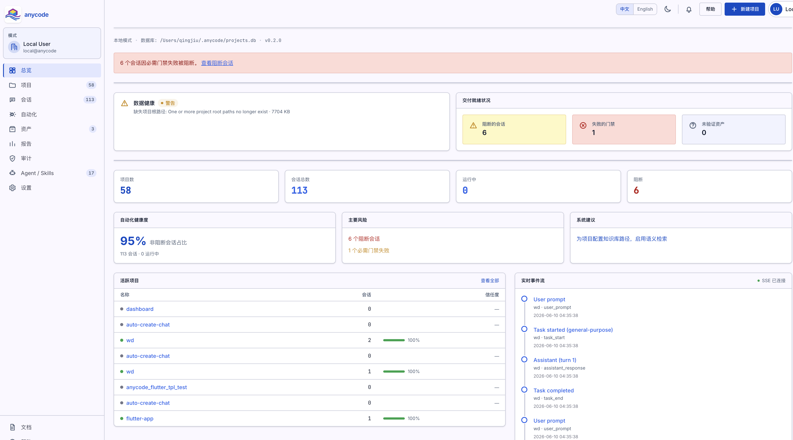
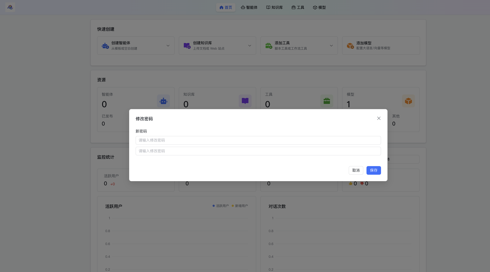
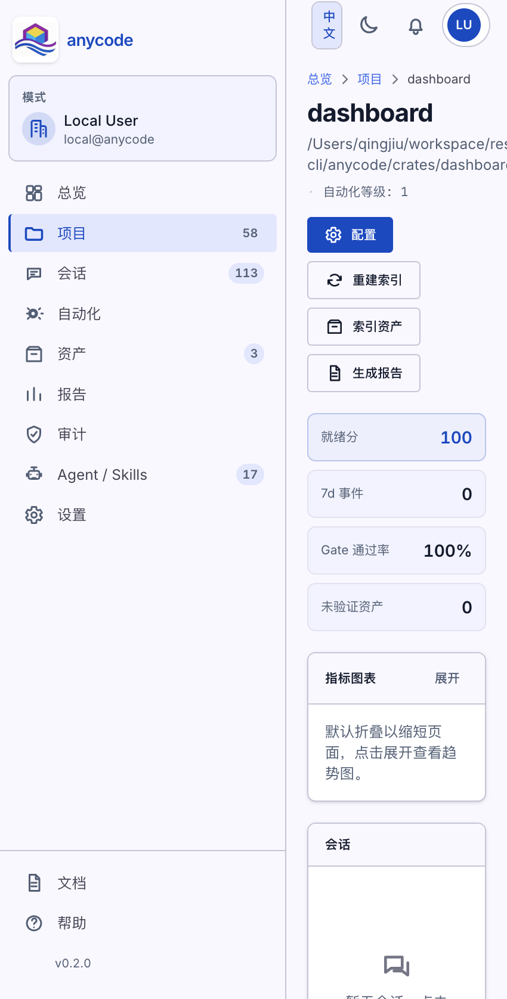
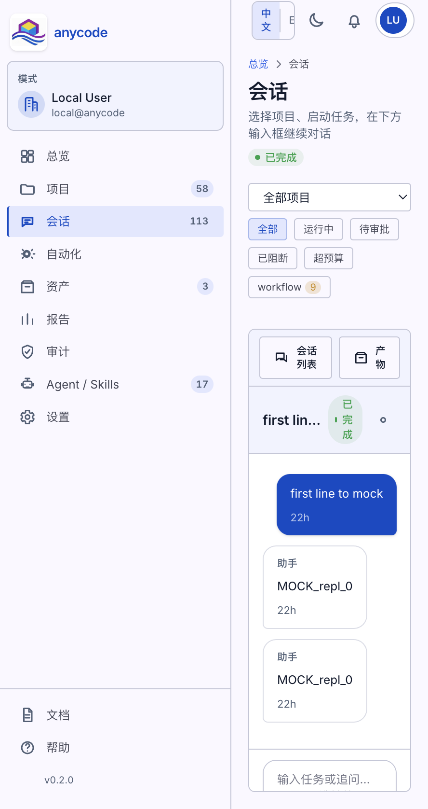
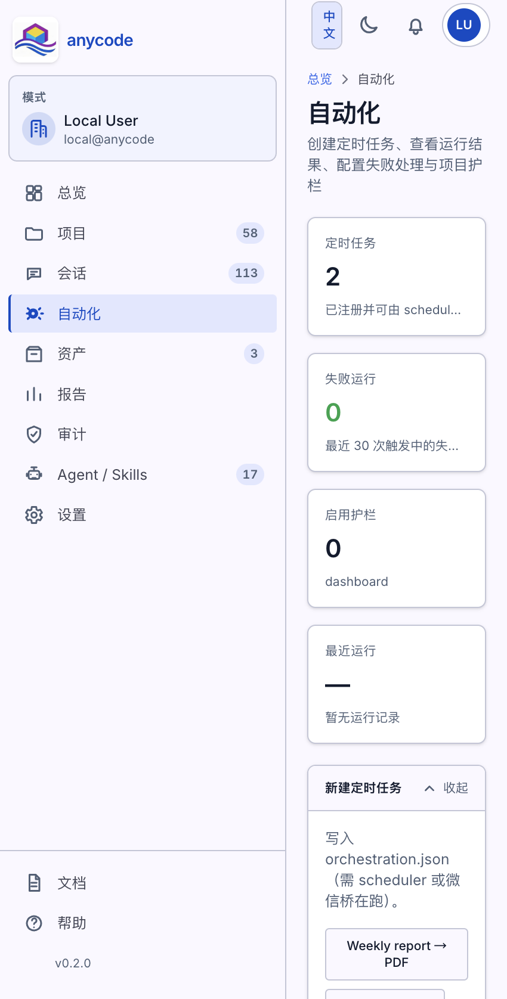
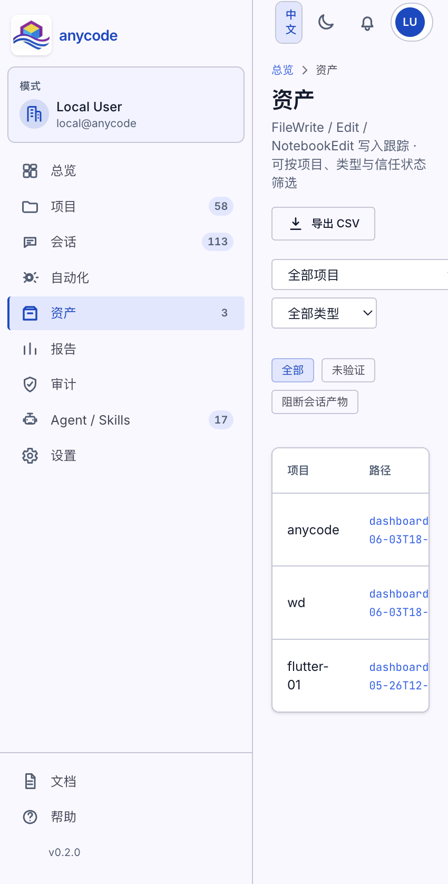
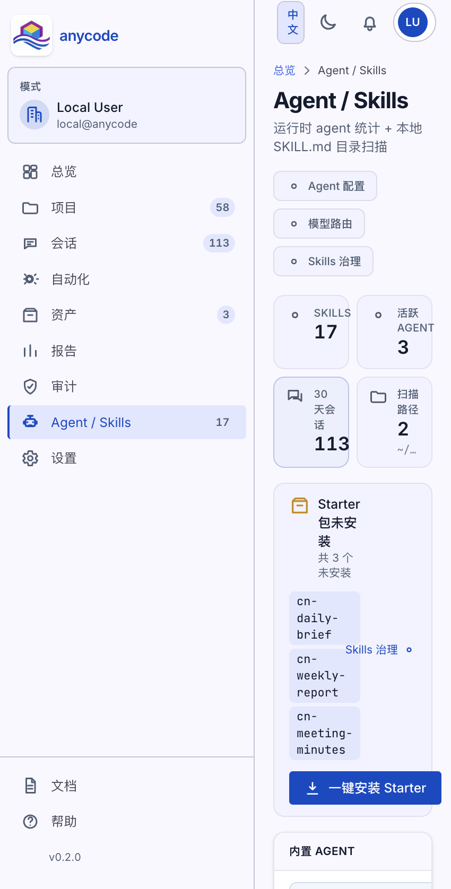
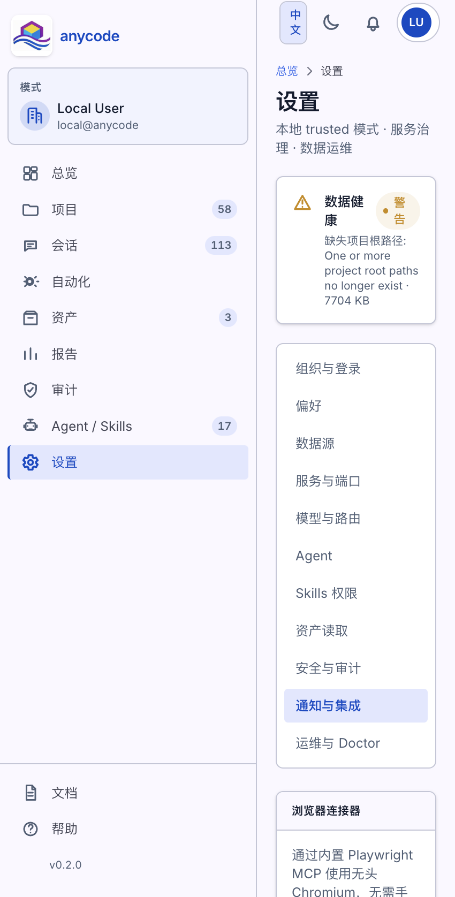
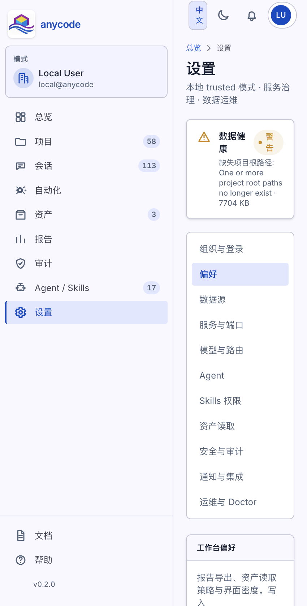

# anyCode 数字工作台 — 功能说明书

> 版本：v0.2.0（截图日期：2026-06-11）  
> 访问地址：`http://127.0.0.1:43180`  
> 启动命令：`anycode dashboard --open`

---

## 1. 产品定位

**anyCode 数字工作台**是 anyCode 的本地 Web 看板，用于统一管理：

- 已登记的工作区项目与信任度
- AI 会话 / 任务执行与审批
- 定时自动化与门禁（Gate）
- 产出文件（资产）与报告
- Agent、Skills、MCP 与浏览器连接器配置

数据保存在本机 SQLite（默认 `~/.anycode/projects.db`），通过 SSE 实时推送事件流。

---

## 2. 启动与登录

| 方式 | 说明 |
|------|------|
| 浏览器 | `anycode dashboard --open` |
| macOS 桌面版 | 打开 anyCode.app，内置启动工作台 |
| 本地账户 | 默认 `local@anycode`，trusted 模式无需密码 |

右上角可切换 **中文 / English**、浅色/深色主题；顶栏 **SSE 已连接** 表示实时事件流正常。

---

## 3. 界面总览



### 3.1 侧栏导航

| 菜单 | 功能 |
|------|------|
| **总览** | 运维摘要、快捷对话、活跃项目、实时事件流 |
| **项目** | 工作区 registry、信任度、扫描/新建/归档 |
| **会话** | 按项目浏览对话，Web 聊天与追问 |
| **自动化** | Cron 定时任务、项目护栏策略 |
| **资产** | FileWrite/Edit 等工具写入的文件跟踪 |
| **报告** | 项目/会话 Markdown 或 HTML 报告 |
| **审计** | 配置变更与安全事件 |
| **Agent / Skills** | Agent 统计、Skills 目录、Starter 包安装 |
| **设置** | 模型、MCP、浏览器、通知、Doctor 等 |

### 3.2 总览页核心区块

1. **快捷对话（Quick Compose）**  
   选择项目后直接输入任务，一键进入会话页；可展开「最近会话 / 分析 / 工作台」面板。Desktop 版会提示启用 **Browser 连接器**。

2. **运维摘要**  
   阻断会话、待审批、预算超限三类指标可点击跳转筛选。

3. **交付就绪 / 自动化健康度 / 风险与建议**  
   汇总 Gate 失败、未验证资产；建议项含「配置知识库路径」等。

4. **实时事件流**  
   后端英文标题在 UI 层自动中文化（如「用户输入」「第 N 轮结束」）。

---

## 4. 项目管理



### 4.1 项目列表

- **扫描新项目**：发现本机新工作区并写入 registry  
- **新建项目**：登记路径，可选 **Flutter 等模板** 自动脚手架  
- **筛选**：按名称/路径搜索，按 active/archived 过滤  
- **信任度**：基于 Gate、资产验证等计算的进度条  

根目录缺失的项目会标红提示「根目录缺失」。

### 4.2 项目详情



| 操作 | 说明 |
|------|------|
| **配置** | 知识库路径、Gate、Pipeline 等项目级策略 |
| **重建索引** | 同步 Skills + 知识库 chunk |
| **索引资产** | 扫描助手改过的文件 |
| **生成报告** | 导出项目交付报告 |

页面展示 **就绪分、7 日事件、Gate 通过率、未验证资产**；下方为会话列表与知识库摘要卡片。

---

## 5. 会话与对话



### 5.1 会话列表

- 按 **项目 / 状态**（运行中、待审批、已阻断、超预算）筛选  
- 左侧会话列表 + 右侧 **对话 + 产物** 双栏布局  

### 5.2 Web 聊天能力

- 底部输入框发送任务或追问  
- 支持选择 **Agent / 模型 / @Skills**  
- **图片附件**：需 Vision 模型；图片经 `@anycode/vision-file:` 协议传入 CLI  
- 工具调用、审批请求在时间线与 transcript 中可视化  

渠道侧（微信 / Telegram / Discord）同样支持图片；Telegram/Discord 语音在配置 STT 后自动转写。

---

## 6. 自动化



### 6.1 定时任务

- 自然语言描述调度（如「每天 8 点」）→ 解析为 cron  
- 任务摘要写入 `orchestration.json`，需本机 **scheduler** 或渠道桥运行  
- 快捷模板：Weekly report、Daily brief 等  

### 6.2 项目护栏

- **门禁失败时阻断**、**Cron 通知**、**完成时生成报告** 等策略  
- 按项目绑定，可启用/禁用  

### 6.3 运行记录

- 已注册 Cron 任务列表  
- `cron-runs.jsonl` 最近触发记录，失败可重试  

---

## 7. 资产与报告



### 7.1 资产页

跟踪 **FileWrite / Edit / NotebookEdit** 写入的文件：

- 按项目、类型、信任状态筛选  
- **未验证 / 阻断会话产物** 快速过滤  
- 导出 CSV、跳转详情查看 hash 与溯源  

### 7.2 报告页（侧栏入口）

- 按项目或会话生成 Markdown/HTML  
- 可在设置中配置默认格式与偏好  

---

## 8. Agent 与 Skills



| 能力 | 说明 |
|------|------|
| **Agent 配置** | 跳转设置，管理主 Agent 与子集 |
| **模型路由** | Provider / 模型选择策略 |
| **Skills 治理** | 扫描 `~/.anycode/skills`，vet 与权限 |
| **Starter 包** | 一键安装 `skills-starter`（含中文场景：日报/周报/会议纪要） |

Skills 使用 `SKILL.md` frontmatter；可选 `description_zh` 在系统提示中展示中文摘要。

---

## 9. 设置

### 9.1 通知与集成（MCP + 浏览器）



| 面板 | 功能 |
|------|------|
| **MCP 服务器** | 图形化编辑 `~/.anycode/config.json` 的 `mcp.servers` |
| **Browser 连接器** | Desktop 版启用 bundled Playwright MCP（无头 Chromium） |
| **通知策略** | Gate 失败、Cron、报告完成等 local_log / 渠道推送 |

### 9.2 偏好与提示词预览



- **UI 密度**、报告导出、资产读取策略  
- **提示词预览**：查看合并后的 system prompt（含 CLAUDE.md、Skills 目录等）  

### 9.3 运维与 Doctor

**设置 → 运维与 Doctor** 运行健康检查，包括：

- Starter Skills 是否齐全  
- 知识库索引 / 向量 feature 是否启用  
- 微信桥、cron orchestration 等  

---

## 10. 与 CLI 的关系

```
终端 anycode（REPL / run）
        ↓ 记录事件
数字工作台 SQLite + SSE
        ↓ 展示 / 审批 / 配置
Dashboard UI（本说明书）
```

- 终端执行任务 → 工作台看时间线与资产  
- 工作台 Web 聊天 → 经 pipe REPL 调用同一 `AgentRuntime`  
- 配置以 `~/.anycode/config.json` 为准，Dashboard 设置页可读写  

更多运行流细节见 [docs/run-flow.md](../ops/run-flow.md)。

---

## 11. 常见问题

| 现象 | 处理 |
|------|------|
| 页面空白 / Loading 久 | 刷新；确认 `anycode dashboard` 进程在跑 |
| SSE 离线 | 检查防火墙；重启 dashboard |
| 列表无数据 | 先在终端对某目录跑一次任务，或「扫描项目」 |
| 知识库搜索弱 | Desktop 版自带向量；CLI 开发构建需 `knowledge-embeddings` feature |
| Browser 工具不可用 | Desktop 版在设置中启用 Browser 连接器并重启 |

---

## 附录：截图索引

| 文件 | 页面 |
|------|------|
| `screenshots/01-home.png` | 总览 |
| `screenshots/02-projects.png` | 项目列表 |
| `screenshots/03-conversations.png` | 会话 / Web 聊天 |
| `screenshots/04-automations.png` | 自动化 |
| `screenshots/05-assets.png` | 资产 |
| `screenshots/06-agents-skills.png` | Agent / Skills |
| `screenshots/07-project-detail.png` | 项目详情 |
| `screenshots/08-settings-notify-mcp-browser.png` | 设置 — 通知 / MCP / 浏览器 |
| `screenshots/09-settings-prefs-prompt.png` | 设置 — 偏好 / 提示词 |

English tour: [docs-site/zh/guide/workbench.md](../../docs-site/zh/guide/workbench.md)

---

## PowerPoint 版本

- **文件：** [anyCode数字工作台功能说明.pptx](./anyCode数字工作台功能说明.pptx)（16 页，含界面截图）
- **重新生成：** `python3 -m venv .venv-ppt && .venv-ppt/bin/pip install python-pptx && .venv-ppt/bin/python scripts/generate-workbench-ppt.py`
