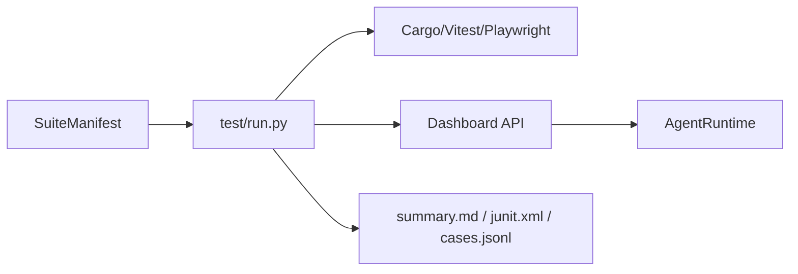

# anyCode 评测体系概览

`test/` 是 anyCode 大版本评测与风险回归的**附加**体系，不替代现有 `cargo test` / Playwright CI。

## 设计原则

1. **复用生产链路**：真实场景通过 Dashboard 会话 API → `AgentRuntime` 执行，不另造 runtime。
2. **渐进披露**：`test/README.md` 仅保留三条命令；细节在本目录与 `manifests/`。
3. **确定性优先**：编译/单测/结构化文件检查/DOM 与 API 状态优先于 LLM judge。
4. **能力感知**：本地 1B 若 metadata 或实时 Glob tool probe 表明 tools 不可用，browser/skills 记为 **N/A**（产品差距），不算失败。

## 执行流程

## 配置文件

| 文件 | 说明 |
|------|------|
| `manifests/smoke.toml` | ≤20 分钟，无真实 LLM |
| `manifests/release-candidate.toml` | 预发布：全量 e2e + 覆盖率快照 |
| `manifests/full.toml` | 大版本 8–12 小时：模型探测 + 基准适配器 |
| `requirements/catalog.toml` | P0/P1 风险要求 → case id 映射 |

## 报告产物

每次运行写入 `test/results/<run-id>/`：

- `summary.md` — 人类摘要
- `cases.jsonl` — 逐例 JSON
- `junit.xml` — CI 集成
- `risk_gate.json` — P0/P1 覆盖率门禁
- `models/<alias>/report.md` — 模型探测与优化建议入口
- `coverage/` — `scripts/test-coverage.sh` 输出（可选）

## 相关文档

- [coverage.md](coverage.md) — 代码覆盖口径
- [scoring.md](scoring.md) — 评分与 fail-fast 规则
- [model-matrix.md](model-matrix.md) — 必测模型与能力矩阵
